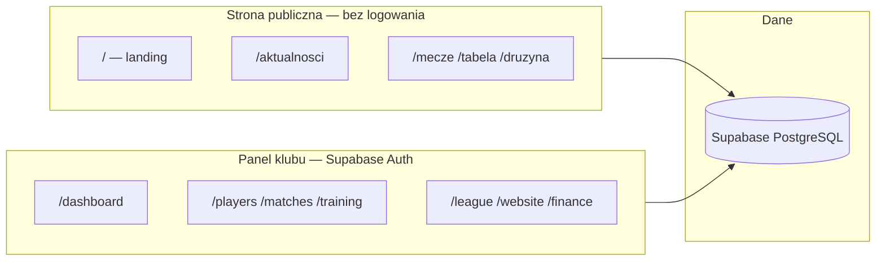

# 01 — Czym jest Football Club OS

## Jedno zdanie

**Football Club OS (FC OS)** to wielodostępna platforma SaaS do zarządzania klubem piłkarskim: panel operacyjny dla sztabu + publiczna strona klubu + synchronizacja danych ligowych z mirrorów internetowych (do czasu API PZPN).

## Dla kogo jest produkt

| Użytkownik | Gdzie pracuje | Po co |
|------------|---------------|--------|
| **Prezes / zarząd** | Dashboard | Klub, finanse, sponsorzy, CRM |
| **Dyrektor sportowy / trener** | Dashboard | Zawodnicy, treningi, mecze, frekwencja, urazy |
| **Koordynator strony** | `/website/*` | Aktualności, media, branding |
| **Koordynator ligi** | `/league/*` | Import tabeli, terminarza, kadry |
| **Rodzic / zawodnik** | Portale (`/finance/portal`, `/injuries/portal`, …) | Składki, status urazu, sprzęt |
| **Sponsor** | `/sponsors/portal` | Publikacje, raporty |
| **Kibic / rodzina** | Strona publiczna `/` | Aktualności, mecze, tabela, kadra |

## Dwie „twarze” produktu

- **Strona publiczna** — marketing + informacja dla kibiców (ISR, slug klubu).
- **Panel (dashboard)** — operacje codzienne klubu (RBAC, RLS).

## Klub referencyjny: Piorun Wawrzeńczyce

| Pojęcie | Wartość | Gdzie w UI |
|---------|---------|------------|
| Nazwa **publiczna** (marka) | Piorun Wawrzeńczyce | Strona, nagłówki, `/druzyna` |
| Nazwa **oficjalna** (licencja) | GLKS Mietków | Protokoły, źródła ligowe |
| Związek | DZPN · Dolnośląskie | CMS / ustawienia |
| Liga seniorów | B Klasa — Wrocław VII — 2025/26 | `/tabela`, League Hub |
| Hasło | *Od Skrzata do Seniora — jedna rodzina, jeden klub* | Hero, FB |
| Telefon | +48 663 595 991 | Kontakt, akademia |
| Facebook (źródło treści) | [profil FB](https://www.facebook.com/profile.php?id=61560486822886) | Import zdjęć / ton |

Szczegóły tożsamości: `docs/archive/audit/piorun-brand-content-guide.md`, `docs/archive/audit/piorun-visual-dna.md`

## Co produkt **robi** (zakres funkcjonalny)

### Operacje klubu (dashboard)

- Zarządzanie **drużynami** i **zawodnikami** (profile, statystyki, kontuzje)
- **Treningi** i **frekwencja**
- **Mecze** (terminarz własny klubu, składy, raporty)
- **Finanse**, **magazyn**, **sprzęt** (equipment)
- **Sponsorzy** i **CRM** (rodzice, partnerzy, darowizny)
- **Komunikacja** (ogłoszenia, czaty drużynowe)
- **Akademia** (grupy wiekowe, scouting, rozwój)
- **AI** (chat, raporty, manager zadań)
- **Wideo** (biblioteka, analiza)
- **Content Hub** (posty pod social / kanały)
- **Strona klubu CMS** (`/website`)
- **League Hub** (mirror danych ligowych)

### Strona publiczna

- Landing z hero, matchday, akademią, newsami, galerią, sponsorami
- Podstrony: kadra, mecze, tabela, aktualności, galeria, kontakt
- Dane z Supabase (RPC + tabele), nie bezpośrednio z 90minut przy każdym wejściu

### Integracje (stan docelowy vs rzeczywistość)

| Integracja | Status |
|------------|--------|
| Supabase Auth / DB / Storage | ✅ Produkcja |
| OpenAI (AI moduły) | ✅ (wymaga `OPENAI_API_KEY`) |
| PZPN / mPZPN API oficjalne | ❌ Brak stabilnego API — mirrory HTML |
| Web Push (PWA) | ⚠️ Wymaga VAPID + `PWA_CRON_SECRET` |
| Facebook import zdjęć | ✅ Skrypt Playwright (ręczny) |

## Czego produkt **nie jest**

- Nie jest gotowym sklepem ani portalem newsowym ogólnym.
- Nie zastępuje **Extranetu PZPN** / **Klubów 24** (brak pełnej integracji).
- Nie gwarantuje **100% bramek per zawodnik** w B Klasie bez ręcznej pracy / rozszerzenia mirrorów.
- **ETAP 15.11** — zamrożony; nie dodawaj nowych dużych modułów bez zlecenia.

## Model biznesowy (techniczny)

- **Multi-tenant:** wiele klubów w jednej bazie (`clubs.club_id` wszędzie).
- **Tenant domyślny w kodzie:** `siteConfig.defaultClubSlug` = `piorun-wawrzenczyce`.
- Publiczne RPC przyjmują `p_club_slug` — gotowe pod kolejne kluby.

## Powiązane pliki w repo

| Plik | Rola |
|------|------|
| `src/config/site.ts` | Nazwa aplikacji, slug domyślny |
| `FIRST_CLUB.md` | Setup pierwszego klubu |
| `PROJECT_CONTEXT.md` | Kontekst (jeśli istnieje) |
