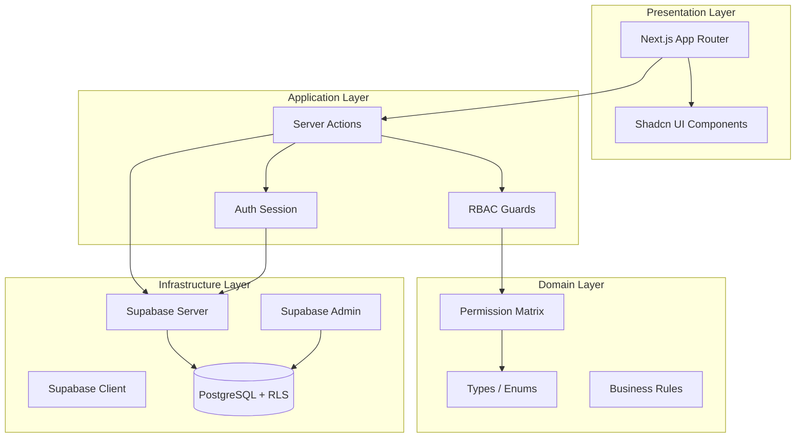

# Architektura systemu

## Wizja

Football Club OS to wielodostępny (multi-tenant) system SaaS do cyfryzacji operacji klubu piłkarskiego — od B Klasy do poziomu półprofesjonalnego.

## Warstwy (Clean Architecture)

## Multi-Tenant

- **Tenant = klub** (`clubs`)
- Każda tabela biznesowa zawiera `club_id`
- Dostęp wymusza **Row Level Security (RLS)** w Supabase
- Użytkownik może należeć do wielu klubów z różnymi rolami (`club_memberships`)
- Kontekst klubu wybierany w sesji aplikacji (etap 2 planu)

## Backend

- **Next.js App Router** — routing, layouty, Server Components
- **Server Actions** — mutacje i logika aplikacyjna (bez osobnego API na start)
- **Route Handlers** — wyłącznie tam, gdzie wymagane (np. OAuth callback)

## Frontend

- **React 19 + TypeScript strict**
- **Tailwind CSS 4** — design tokens przez CSS variables (Shadcn)
- **Shadcn UI** — komponenty bazowe w `src/components/ui/`

## Integracje (planowane)

| Usługa | Status fundamentu | Moduł docelowy |
|--------|-------------------|----------------|
| Supabase Auth | Skonfigurowany | Logowanie, zaproszenia |
| Supabase Storage | Planowany | Dokumenty, zdjęcia |
| Supabase Realtime | Planowany | Powiadomienia na żywo |
| OpenAI API | Planowany | Asystent AI klubu |

## Bezpieczeństwo

1. **RLS** — pierwsza linia obrony na poziomie bazy
2. **RBAC** — druga linia w Server Actions (`src/lib/rbac/`)
3. **Service Role** — tylko server-side, nigdy w przeglądarce
4. **Walidacja env** — `src/config/env.ts` (Zod)

## Deployment

- **GitHub** → źródło kodu i historii migracji
- **Vercel** → build i hosting Next.js
- **Supabase** → baza, auth, storage

Każdy commit ukończonego etapu = osobny commit (zasada projektu).
