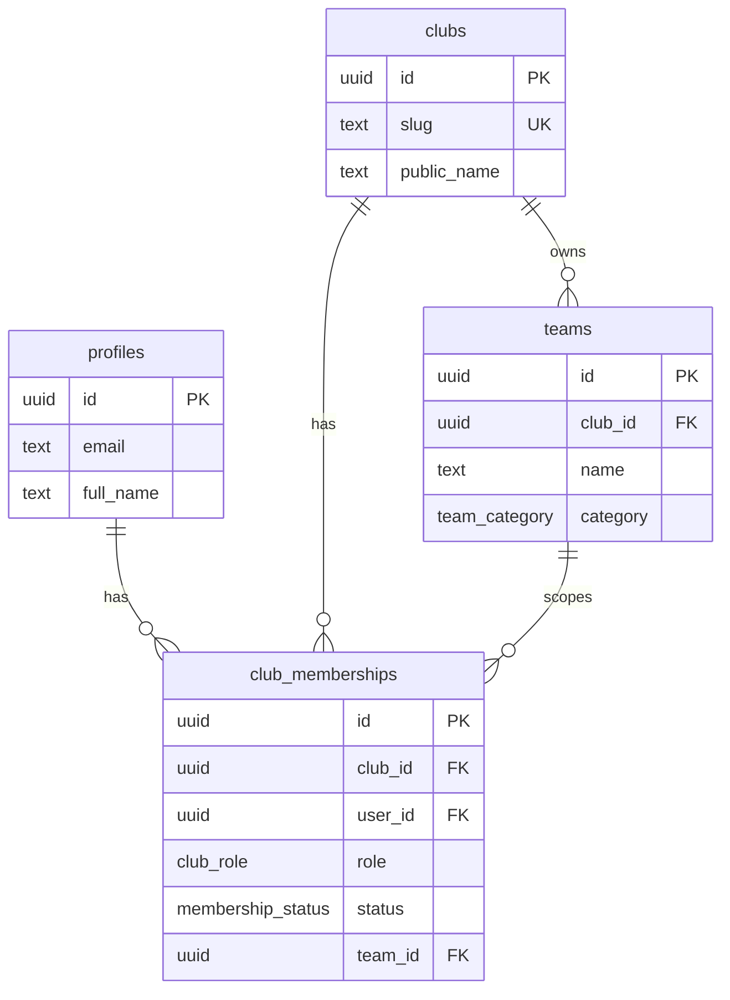
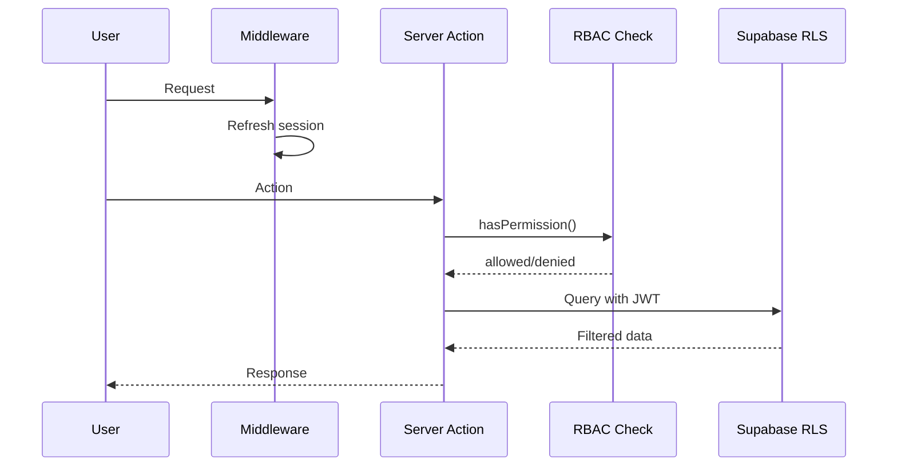

# RBAC — Role-Based Access Control

## Role klubowe

| Rola | Kod | Opis |
|------|-----|------|
| Administrator platformy | `platform_admin` | Zarządzanie SaaS (przyszłość) |
| Zarząd | `board` | Pełne zarządzanie klubem |
| Trener | `coach` | Zarządzanie drużynami |
| Zawodnik | `player` | Dostęp do własnych danych |
| Rodzic | `parent` | Dostęp do danych dziecka |
| Sponsor | `sponsor` | Widok informacji sponsorskich |
| Kibic | `fan` | Dostęp publiczny klubu |

## Macierz uprawnień (fundament)

| Uprawnienie | platform_admin | board | coach | player | parent | sponsor | fan |
|-------------|:--------------:|:-----:|:-----:|:------:|:------:|:-------:|:---:|
| `club:read` | ✓ | ✓ | ✓ | ✓ | ✓ | ✓ | ✓ |
| `club:manage` | ✓ | ✓ | — | — | — | — | — |
| `team:read` | ✓ | ✓ | ✓ | ✓ | ✓ | ✓ | ✓ |
| `team:manage` | ✓ | ✓ | ✓ | — | — | — | — |
| `member:read` | ✓ | ✓ | ✓ | ✓ | ✓ | — | — |
| `member:manage` | ✓ | ✓ | — | — | — | — | — |
| `member:invite` | ✓ | ✓ | — | — | — | — | — |
| `settings:read` | ✓ | ✓ | ✓ | — | — | — | — |
| `settings:manage` | ✓ | ✓ | — | — | — | — | — |

Implementacja w kodzie: `src/config/permissions.ts` + `src/lib/rbac/permissions.ts`

## Model danych RBAC

## Zasady

1. Użytkownik może mieć **wiele ról** w jednym klubie (np. trener + członek zarządu).
2. Uprawnienia są **sumą** wszystkich aktywnych ról (`status = active`).
3. RLS w PostgreSQL filtruje dane po `club_id` i roli.
4. Server Actions weryfikują uprawnienia przed każdą mutacją.
5. Uprawnienia modułowe (np. `match:manage`) zostaną dodane per moduł.

## Scope zespołu (`team_id`) — wdrożone (ETAP 11.5)

- Opcjonalne pole w `club_memberships`
- Trener z przypisanym `team_id` widzi **tylko zawodników, treningi i mecze swojej drużyny** (RLS: `actor_can_read_team_resource`, `actor_can_read_player_row`)
- Trener bez `team_id` (trener główny) — dostęp club-wide w ramach roli coach
- Zarząd (`owner`, `president`, `sports_director`) — pełny odczyt klubu
- Zawodnik — wyłącznie własny profil (`player_id_for_user`)
- Rodzic — wyłącznie dzieci (`parent_player_ids`)

### Helpery RLS (PostgreSQL)

| Funkcja | Opis |
|---------|------|
| `actor_can_read_player_row(club, player)` | Odczyt wiersza zawodnika |
| `actor_can_manage_player_row(club, player)` | Mutacja zawodnika (scope trenera) |
| `actor_can_read_team_resource(club, team)` | Odczyt treningów/meczów |
| `actor_can_manage_team_resource(club, team)` | Mutacja treningów/meczów |
| `coach_team_ids(club)` | Drużyny przypisane trenerowi |

Aplikacja: `src/lib/players/access.ts` — guard na `/players/[id]`.

## Przepływ autoryzacji (docelowy)

