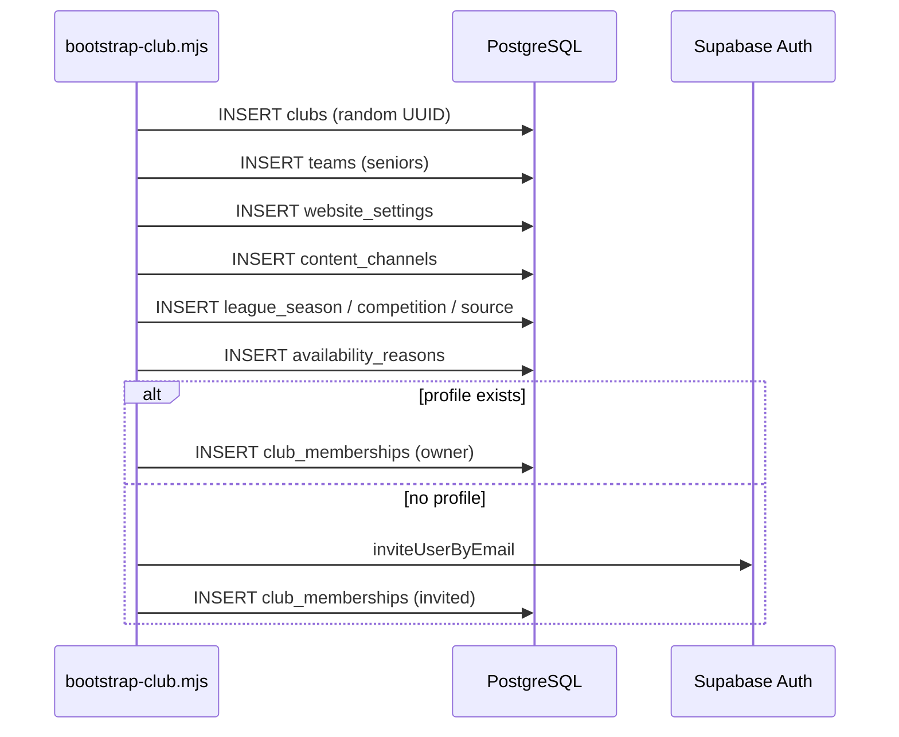

# FC OS Bootstrap Club — Design

Sprint 17.3 · `scripts/bootstrap-club.mjs`

## Prerequisites

```
Empty Supabase project
  └── supabase/baseline.sql applied
  └── .env.local configured
```

## Flow



## vs setup-stage1.mjs

| Aspekt | setup-stage1 | bootstrap-club |
|--------|--------------|----------------|
| Club UUID | Hardcoded Piorun | `gen_random_uuid()` |
| Migracje | All 105 files | Wymaga prior baseline |
| Test users | 8 fixed emails | Tylko owner |
| League config | Seed Piorun/GLKS | Empty inactive source |
| Multi-club | ❌ | ✅ |

## League config (manual after bootstrap)

`league_sources.config` example structure (not inserted by bootstrap):

```json
{
  "sources": ["90minut.pl/ligaXXXXX", "regionalnyfutbol.pl/..."],
  "ownLeagueName": "Team Official Name",
  "ownDisplayName": "Public Display Name"
}
```

Enable sync: set `is_active = true`, then `npm run sync:league-live`.
