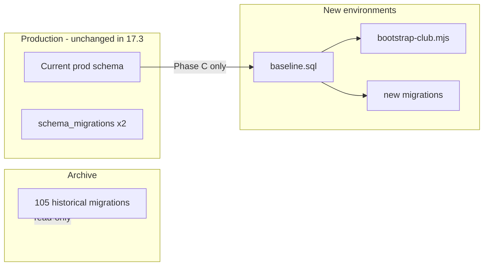

# Sprint 17.3 — Migration Strategy

Przejście z 105 historycznych migracji na `baseline.sql` + nowe migracje **bez ryzyka dla produkcji**.

## Stan wyjściowy

| Element | Wartość |
|---------|---------|
| Historyczne migracje | 105 plików w `supabase/migrations/` |
| Baseline | `supabase/baseline.sql` (69 źródeł skonsolidowanych) |
| Archiwum | 36 plików (seedy, Piorun, data-fix) |
| Prod tracking | 2 wpisy w `schema_migrations` |
| Prod schema | 104 tabele (44 mniej niż baseline) |

---

## Phase A — Freeze & Archive (zero wpływu na prod)

**Cel:** Zamrozić historyczne migracje jako read-only archiwum.

1. Przenieś `supabase/migrations/` → `supabase/migrations-archive/` (lub dodaj README „archived — do not apply”).
2. Dodaj `supabase/baseline.sql` jako nowy punkt startowy.
3. Utwórz `supabase/seeds/` dla opcjonalnych seedów dev (bez fixed UUID).
4. **Nie dotykaj produkcji** — prod nadal działa na dotychczasowym schemacie.
5. Dokumentuj: nowe projekty = `baseline.sql` → `bootstrap-club.mjs`.

**Ryzyko:** Brak (tylko repo).

**Czas:** 1 dzień.

---

## Phase B — New Environment Path (dev/staging/club #2)

**Cel:** Walidacja ścieżki repo → clean DB → baseline → klub.

1. Utwórz **nowy** projekt Supabase (staging lub club #2).
2. Apply `baseline.sql` via `node scripts/run-sql.mjs supabase/baseline.sql`.
3. Insert baseline version do `supabase_migrations.schema_migrations`:
   ```sql
   INSERT INTO supabase_migrations.schema_migrations (version, name)
   VALUES ('20260704000000', 'fc_os_baseline_173');
   ```
4. Run `node scripts/bootstrap-club.mjs --slug ... --dry-run` then live.
5. Smoke test: RPC `get_public_home_bundle`, dashboard login, league hub empty state.
6. CI (future): ephemeral Postgres + apply baseline + typecheck queries.

**Ryzyko:** Niskie — izolowane środowisko.

**Czas:** 2–3 dni (w tym pierwszy test end-to-end).

---

## Phase C — Production Alignment (planowany, osobny sprint)

**Cel:** Doprowadzić prod do baseline parity **bez** `db push` od zera.

> ⚠️ Phase C **nie jest częścią Sprintu 17.3** — wymaga okna maintenance i backupu.

### C1 — Backfill brakujących modułów (44 tabele)

Prod brakuje: Finance, Inventory, Academy, Integrations (+ powiązane).

Opcja preferowana: **forward migrations** (nie re-apply baseline):

```
supabase/migrations-forward/
  20260705000000_prod_finance_inventory_academy_integrations.sql
```

Wygenerować diff: `baseline tables MINUS prod tables` → jeden idempotentny patch SQL.

### C2 — schema_migrations reconciliation

Po Phase C1:

```sql
-- Baseline marker
INSERT INTO supabase_migrations.schema_migrations (version, name)
VALUES ('20260704000000', 'fc_os_baseline_173')
ON CONFLICT DO NOTHING;

-- Opcjonalnie: backfill historycznych wersji jako "applied_legacy"
-- (informacyjnie, bez re-run SQL)
```

### C3 — Nowe migracje od baseline forward

Struktura docelowa:

```
supabase/
  baseline.sql              # v20260704000000 — applied once
  migrations/               # NOWE pliki od 20260705*
    20260705120000_add_xyz.sql
```

Reguła: każda nowa migracja **musi** kończyć się insertem do `schema_migrations`.

### C4 — Weryfikacja prod

- Porównaj tabele, RPC, policy count z baseline validation report
- Smoke test produkcji Piorun (zero regresji)
- Dopiero potem bootstrap klubu #2 na tym samym Supabase (multi-tenant) lub osobnym projekcie

**Ryzyko:** Średnie–wysokie (Phase C tylko z PITR backup).

**Czas:** 1–2 tygodnie (osobny sprint).

---

## Diagram



---

## Reguły operacyjne (od Sprint 17.3)

1. **Nigdy** `supabase db push` na istniejącej prod bez Phase C planu.
2. **Nowe kluby** — tylko baseline + bootstrap (nie 105 migracji).
3. **Nowe zmiany schematu** — pliki w `supabase/migrations/` od wersji `20260705*`.
4. **Seedy** — `supabase/seeds/` lub `bootstrap-club.mjs`, nigdy w baseline.
5. **Każda migracja** — idempotentna gdzie możliwe + tracking w `schema_migrations`.
