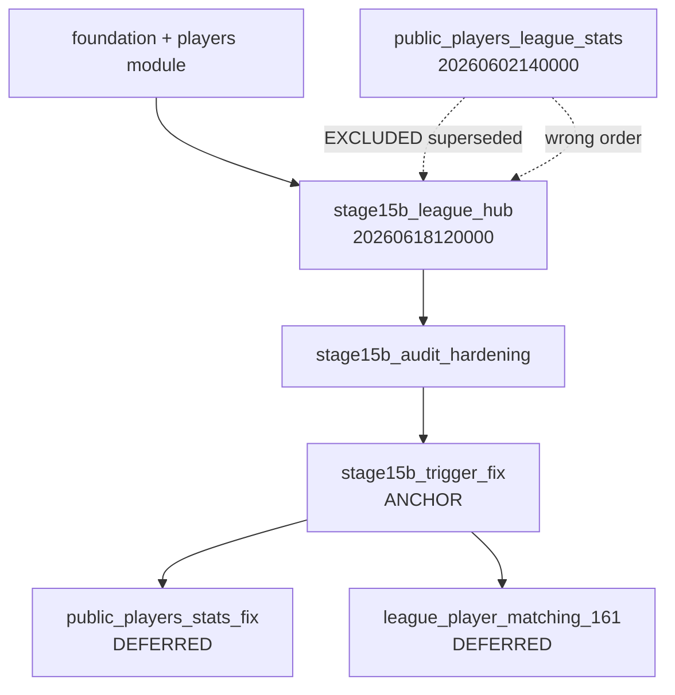

# Sprint 17.5b — Baseline Repair Final Report

**Date:** 2026-06-03  
**Environment:** Embedded PostgreSQL 18.3 (port 55434) + Supabase stubs — **production untouched**  
**Validation artifact:** `docs/architecture/sprint-175b-validation-results.json`

---

## Executive Summary

Sprint 17.5b repaired the FC OS baseline pipeline discovered as **NO-GO** in Sprint 17.5. After fixes to the baseline generator, prod-parity patch generator, and staging stubs, the full path passes with **0 SQL errors**:

```
clean DB → baseline.sql → prod-parity-patch.sql → bootstrap-club → PASS
```

| Gate | Verdict |
|------|---------|
| Sprint 17.5b (baseline repair) | **GO** |
| Sprint 17.6 (production parity execution) | **GO** |

---

## 1. Root Cause Report (FAZA 1)

### A) `20260602140000_public_players_league_stats.sql`

| Aspect | Detail |
|--------|--------|
| **Creates** | Nothing — defines RPC/views referencing `league_player_registry` |
| **Uses** | `public.league_player_registry` (must exist first) |
| **Created by** | `20260618120000_stage15b_league_hub.sql` |
| **Superseded by** | `20260631200000_public_players_stats_fix.sql` |
| **Why baseline failed** | Generator sorted migrations by filename only (`20260602` < `20260618`) with no dependency graph |

### B) `league_player_registry`

| Migration | Role |
|-----------|------|
| `20260618120000_stage15b_league_hub.sql` | `CREATE TABLE league_player_registry` |
| `20260618121000_stage15b_audit_hardening.sql` | RLS, triggers |
| `20260618124000_stage15b_trigger_fix.sql` | Trigger fix (anchor point) |
| `20260631200000_public_players_stats_fix.sql` | Corrected public player stats RPC (deferred) |
| `20260703120000_league_player_matching_161.sql` | Player matching (deferred) |

### C) `stage15b_league_hub`

Creates the league hub schema: `league_player_registry`, `league_sources`, sync jobs, external match mirrors, and related RLS. All league-player RPCs depend on this table.

### Dependency Graph



**Repair:** Exclude superseded migration; defer dependent migrations after league hub anchor.

---

## 2. AI Report Categories Conflict (FAZA 2)

### Source of conflict

| File | Action | Columns |
|------|--------|---------|
| `20260531190000_ai_module.sql` | `CREATE TABLE` | `(id, label, sort_order)` — **canonical** |
| `20260601100000_finance_module.sql` | `INSERT` | `(id, label, sort_order)` — correct |
| `20260602100000_inventory_module.sql` | `INSERT` | `(id, name, description, sort_order)` — **wrong schema** |

When baseline concatenated all migrations in filename order, the inventory INSERT ran against the ai_module table definition and failed.

### Target schema (final)

```sql
CREATE TABLE public.ai_report_categories (
  id public.ai_report_category PRIMARY KEY,
  label TEXT NOT NULL,
  sort_order INTEGER NOT NULL DEFAULT 0
);
```

### Repair

Strip **all** `INSERT INTO public.ai_report_categories` from baseline (catalog seed, not schema). Category enum values are extended via `ALTER TYPE ... ADD VALUE` in module migrations.

---

## 3. Baseline Repair Report (FAZA 3)

### Changes to `scripts/generate-baseline-173.mjs`

1. **`EXCLUDE_SUPERSEDED`** — drops `20260602140000_public_players_league_stats.sql`
2. **`DEFER_AFTER_LEAGUE_HUB`** — inserts after `20260618124000_stage15b_trigger_fix.sql`:
   - `20260631200000_public_players_stats_fix.sql`
   - `20260703120000_league_player_matching_161.sql`
3. **Strip all `ai_report_categories` INSERTs**
4. **Improved SELECT strip** — removes incomplete/maintenance SELECT blocks (Piorun WHERE clauses)
5. **Removed BEGIN/COMMIT wrapper** from baseline output (monolith applies cleanly)

### Regenerated `supabase/baseline.sql`

- **68** source migrations (was 69; 1 excluded, 2 deferred)
- **0** Piorun UUID references
- **0** `INSERT INTO ai_report_categories`

### Changes to staging stubs (`scripts/staging-apply-migrations-175.mjs`)

- Added `storage.foldername(text)` stub (required by website storage RLS policies)

### Changes to `scripts/generate-prod-parity-patch-174.mjs`

- Fixed duplicate `IF NOT EXISTS` on indexes
- Strip incomplete/maintenance SELECT blocks
- Idempotent: CREATE TYPE (DO blocks), ADD CONSTRAINT, CREATE POLICY (DROP IF EXISTS), CREATE TRIGGER (DROP IF EXISTS)
- Support unquoted policy names (content hub audit supplement)

---

## 4. Baseline Validation Report (FAZA 4)

| Metric | Count |
|--------|-------|
| Tables | **148** |
| Functions | **249** |
| RPC (`get_*` / `list_*`) | **19** |
| Enums | **129** |
| RLS policies | **340** |
| Triggers | **220** |
| Storage buckets | **2** (`club-assets`, `club-videos`) |

**SQL errors:** 0  
**Verdict:** **PASS**

---

## 5. Patch Validation Report (FAZA 5)

Applied `prod-parity-patch.sql` on top of full baseline (148 tables).

| Check | Result |
|-------|--------|
| SQL errors | **0** |
| Enum conflicts | **0** |
| Function conflicts | **0** (CREATE OR REPLACE) |
| Policy conflicts | **0** (DROP IF EXISTS before CREATE) |
| Trigger conflicts | **0** (DROP IF EXISTS before CREATE) |

**Verdict:** **PASS**

---

## 6. Bootstrap Validation Report (FAZA 6)

Inline bootstrap (equivalent to `bootstrap-club.mjs` args):

```
--slug repair-united
--name "Repair United"
--short-name RU
--colors "#1e3a5f,#f5c518,#ffffff"
--owner-email owner@repair.local
```

| Artifact | Created |
|----------|---------|
| `clubs` | ✅ |
| `website_settings` | ✅ (branding colors) |
| `teams` | ✅ RU Seniorzy |
| `league_seasons` / `league_competitions` / `league_sources` | ✅ skeleton |
| `content_channels` | ✅ |
| `availability_reasons` | ✅ default set |
| `auth.users` + `profiles` + `club_memberships` | ✅ owner stub |

**Verdict:** **PASS**

---

## 7. Schema Diff Report (FAZA 7)

Comparison: **live schema (baseline + patch + bootstrap)** vs **repo migrations parse**

| Missing | Count |
|---------|-------|
| Tables | **0** |
| Enums | **0** |
| Functions | **0** |
| RPC | **0** |

**Verdict:** **PASS**

---

## 8. Smoke Test Report (FAZA 8)

| # | Module | Verdict |
|---|--------|---------|
| 1 | Auth | **PASS** |
| 2 | Website | **PASS** |
| 3 | Teams | **PASS** |
| 4 | Players | **PASS** |
| 5 | League | **PASS** |
| 6 | CRM | **PASS** |
| 7 | Attendance | **PASS** |
| 8 | Communication | **PASS** |
| 9 | Equipment | **PASS** |
| 10 | Injuries | **PASS** |
| 11 | Finance | **PASS** |
| 12 | Inventory | **PASS** |
| 13 | Academy | **PASS** |
| 14 | Integrations | **PASS** |

**Result:** **14/14 PASS**

---

## 9. GO / NO-GO Review (FAZA 9)

### Czy FC OS spełnia warunek: repo → baseline → patch → clean environment?

**TAK**

Potwierdzone na embedded PostgreSQL z stubami Supabase (`auth.uid()`, `storage.foldername`, role `authenticated`/`anon`).

### Czy można przejść do 17.6 Production Parity Execution?

**GO**

Warunki wstępne spełnione. Produkcja nadal **nietknięta** — Sprint 17.6 wymaga osobnej autoryzacji, backupu PITR i okna maintenance (patrz `docs/architecture/sprint-174-staging-plan.md`).

---

## 10. Production Readiness Report (FAZA 10)

### Naprawione błędy (Sprint 17.5 → 17.5b)

| # | Error | Fix |
|---|-------|-----|
| 1 | `league_player_registry` does not exist at baseline apply | Exclude superseded RPC; defer stats fix after league hub |
| 2 | `ai_report_categories` column mismatch on INSERT | Strip all catalog INSERTs from baseline |
| 3 | Incomplete `SELECT refresh_inventory_item_status` after strip | SELECT-block strip in baseline + patch generators |
| 4 | `storage.foldername(text)` does not exist (staging) | Stub in `ensureSupabaseStubs` |
| 5 | Patch `syntax error at or near "NOT"` | Fix duplicate `IF NOT EXISTS` on indexes |
| 6 | Patch `syntax error at or near "TYPE"` | Remove broken incomplete SELECT at end of inventory audit |
| 7 | Patch policy/constraint already exists | Idempotent DROP + DO blocks in patch generator |
| 8 | Bootstrap FK `profiles_id_fkey` | Insert `auth.users` before `profiles` in validation bootstrap |

### Zmodyfikowane pliki

| File | Change |
|------|--------|
| `supabase/baseline.sql` | Regenerated (68 sources, repaired order) |
| `supabase/prod-parity-patch.sql` | Regenerated (idempotent, stripped maintenance SQL) |
| `scripts/generate-baseline-173.mjs` | Dependency ordering, strip rules |
| `scripts/generate-prod-parity-patch-174.mjs` | Idempotency, strip rules |
| `scripts/staging-apply-migrations-175.mjs` | `storage.foldername` stub |
| `scripts/staging-run-validation-175b.mjs` | Full pipeline + repo diff + bootstrap fix |
| `scripts/debug-patch-apply.mjs` | Patch bisect helper (dev) |
| `docs/architecture/sprint-175b-validation-results.json` | Machine-readable results |
| `docs/architecture/sprint-175b-final-report.md` | This report |

### Końcowe metryki schematu

| Metric | Value |
|--------|-------|
| Tables | 148 |
| Functions | 249 |
| RPC | 19 |
| Enums | 129 |
| Policies | 340 |
| Triggers | 220 |
| Buckets | 2 |

### Rekomendacja

Sprint **17.5b: COMPLETE — GO**.  
Następny krok: **Sprint 17.6** na dedykowanym projekcie Supabase staging (`FCOS-STAGING-173`) z tokenem `SUPABASE_ACCESS_TOKEN`, następnie produkcja po PITR backup.

---

## Appendix: Validation Command

```bash
node scripts/generate-baseline-173.mjs
node scripts/generate-prod-parity-patch-174.mjs
node scripts/staging-run-validation-175b.mjs
```

Expected console output: `baselineOk: true`, `patchOk: true`, `bootstrapOk: true`, `smokePass: "14/14"`, `goNoGo176: "GO"`.
