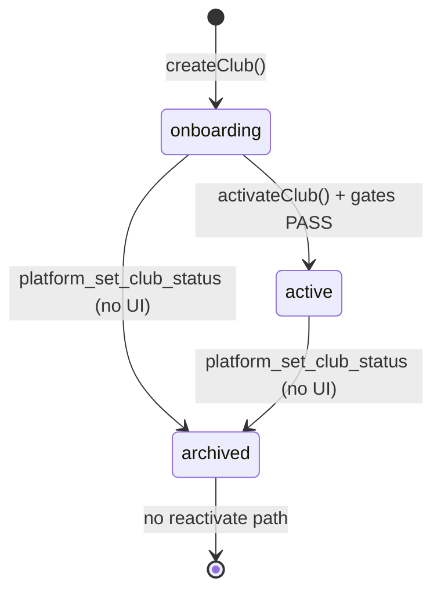

# Sprint 19.0A — Multi-Club Operations Audit

**Data:** 2026-06-04  
**Tag baseline:** `pre-19-multi-club-operations`  
**Typ:** audyt architektury (tylko odczyt — **bez** zmian kodu, migracji, commitów)  
**Kontekst:** Platform Monitoring + Alerts (18.5x–18.6C) ukończone; ocena gotowości FC OS do operacji wieloklubowych z poziomu Platform Admin.

---

## 1. Raport audytu (executive)

### Werdykt

| Obszar | Gotowość | Ocena |
|--------|----------|-------|
| **Tworzenie i onboarding klubu** | ✅ Silna | Operator może utworzyć klub, skonfigurować ligę, przejść checklistę i aktywować (`onboarding` → `active`) bez SQL. |
| **Rejestr klubów (read)** | ⚠️ Częściowa | Lista + filtry statusu + właściciel + onboarding; brak wyszukiwania, health score w rejestrze, sortowania operacyjnego. |
| **Dashboard operatora** | ⚠️ Częściowa | KPI i agregaty health są; brak jednego widoku „które kluby wymagają działania” z linkami operacyjnymi. |
| **Monitoring + alerty** | ✅ Silna | Health v2, alerty z deduplikacją, Sync History — dobre do diagnozy; słabe spięcie z akcjami lifecycle (archiwum, szczegóły klubu). |
| **Akcje administracyjne (write)** | ❌ Luki | Aktywacja ✅; **archiwizacja bez UI**; brak reaktywacji z `archived`; brak `suspended` na poziomie klubu. |
| **Skala (N klubów)** | ⚠️ Ryzyko | `listPlatformClubs()` = N× zapytań onboarding + owner na każdy wiersz — OK przy 2–5 klubach, problem przy dziesiątkach. |

**Ogólna rekomendacja:** FC OS jest **gotowy do obsługi 2–5 klubów produkcyjnych + klubów testowych** z monitoringiem i onboardingiem. Do pełnego **Multi-Club Operations** (codzienna praca operatora SaaS) brakuje warstwy **Operations Registry** — jednego miejsca: klub → status lifecycle → health → ostatnia akcja → szybkie akcje (archiwum, monitoring, detail).

**Ocena gotowości operacyjnej:** **~65%** (fundament multi-tenant + platform admin istnieje; brakuje domknięcia lifecycle write-path i widoku operacyjnego).

---

## 2. Obecna architektura

### 2.1 Model lifecycle klubu

#### `clubs.status` (kolumna TEXT w DB, semantyka aplikacyjna)

| Status | Ustawiany przez | Znaczenie operacyjne |
|--------|-----------------|----------------------|
| **`onboarding`** | `createClub()` przy INSERT | Klub utworzony; brak public site; nie w cron mirror (tylko `active`). |
| **`active`** | `activateClub()` → RPC `platform_set_club_status(..., 'active')` | Public `/{slug}`, cron mirror_live, pełny tenant. |
| **`archived`** | RPC `platform_set_club_status(..., 'archived')` — **tylko backend, brak UI** | Wyłączenie z operacji; monitoring pomija (`health.ts`, alerty). |

**Reguły RPC** (`platform_set_club_status`):

- `active` — tylko z `onboarding` (nie z `archived`).
- `archived` — z `active` lub `onboarding`.
- Brak przejścia `archived` → `active` (reaktywacja wymagałaby nowej reguły + UI).

#### `suspended` na poziomie klubu

**Nie istnieje** jako `clubs.status`.

`suspended` występuje wyłącznie w enumie **`membership_status`** (`club_memberships`) — dotyczy użytkownika w klubie, nie tenanta klubu.

#### Onboarding checklist (osobny model)

`computeClubOnboardingStatus()` — kroki: branding, website, league, owner, media → `overall`.

- **Nie** zmienia `clubs.status`.
- Widoczny w: lista klubów, detail klubu, dashboard (tabela onboarding).
- Klub może mieć checklistę `complete`, ale nadal `onboarding` do momentu **Aktywuj klub**.

#### Kluby testowe

- Brak flagi DB `is_test`.
- Konwencja slugów: `pilot-club-test`, `release-184a-*`, `pilot-club-*`.
- Alerty (18.6C): ukryte alerty operacyjne + jeden INFO zbiorczy.
- Handoff: ręczna archiwizacja `release-184a-mpz313we` — **bez** dedykowanego flow w UI.



### 2.2 Club Registry — źródło i kompletność

| Aspekt | Implementacja |
|--------|----------------|
| **Źródło listy** | `listPlatformClubs()` — `clubs` via `createAdminClient()`, filtr `?status=active\|onboarding\|archived` |
| **Detail** | `getPlatformClubDetail()` — pełna lista + find (N+1 jak lista) |
| **Pola klubu (DB)** | `id`, `slug`, `public_name`, `official_name`, `association`, `competition_level`, `country`, `voivodeship`, `status`, `settings` (JSONB: audit, branding bootstrap) |
| **Właściciel** | `club_memberships` role=`owner` + `profiles.email`; status członkostwa (`active`/`invited`/…) |
| **Relacja z ligą** | `league_sources` per `club_id`; wizard 18.3; panel `/platform/clubs/[id]/league` |
| **Strona publiczna** | `publicUrl: /{slug}` — tylko sensowna gdy `active` |

**Kompletność danych dla operatora**

| Pole / sygnał | W rejestrze klubów | W monitoringu | W dashboardzie |
|---------------|-------------------|---------------|----------------|
| Status lifecycle | ✅ | ✅ (filtr health) | ✅ KPI |
| Onboarding checklist | ✅ | ✅ (INFO alert) | ✅ tabela (max 10) |
| Health score / level | ❌ | ✅ Club Health | ✅ agregaty |
| Ostatni sync / błędy | ❌ | ✅ Sync History | ✅ 10 ostatnich jobów |
| Provider ligi | ❌ | ✅ League Health | ❌ |
| Archiwum (akcja) | ❌ | — | ❌ |

**Wydajność rejestru:** dla każdego klubu osobno: onboarding (4–5 zapytań) + owner + profile — **brak batch/cache** w jednym ładowaniu listy.

### 2.3 Platform Dashboard (`/platform`)

`loadPlatformDashboard()` ładuje:

1. Wszystkie kluby (status, settings).
2. Liczba aktywnych `league_sources`.
3. 10 ostatnich `league_sync_jobs`.
4. `computePlatformHealthSummary()` — ponowne liczenie health (dodatkowy koszt vs. bundle monitoringu).

**Operator może szybko odpowiedzieć:**

| Pytanie | Odpowiedź na dashboardzie? |
|---------|---------------------------|
| Ile jest klubów? | ✅ `totalClubs` |
| Które aktywne? | ✅ `activeClubs` (liczba, nie lista) |
| Które w onboardingu? | ✅ liczba + tabela do 10 wierszy |
| Które mają problemy? | ⚠️ Tylko **liczniki** HEALTHY/WARNING/CRITICAL — **bez listy klubów** z linkiem |
| Archiwum? | ❌ brak KPI `archivedClubs` na dashboardzie (jest w `PlatformHealthSummary`, nie w KPI cards) |

Linki: Monitoring, Audit Center — **nie** ma skrótu „kluby CRITICAL” → `/platform/monitoring` z filtrem.

### 2.4 Operations use cases

| Use case | Stan | Uwagi |
|----------|------|-------|
| **Utworzenie klubu** | ✅ | `/platform/clubs/new`, `createClubAction` |
| **Aktywacja klubu** | ✅ | Detail + `ClubActivationCard`, gates G1–G5, audit `club_activated` |
| **Archiwizacja klubu** | ❌ UI | RPC + `platformSetClubStatus(..., 'archived')` w TS — **brak** `archiveClubAction`, przycisku, audit action `club_archived` |
| **Reaktywacja z archiwum** | ❌ | RPC blokuje `active` spoza `onboarding` |
| **Wyszukanie klubu** | ❌ | Brak query po nazwie/slug |
| **Filtrowanie klubów** | ⚠️ | Tylko `status` (4 linki); brak filtra health / provider / test |
| **Problematyczne kluby** | ⚠️ | Tylko w `/platform/monitoring` (Club Health + Alerts); rejestr `/platform/clubs` bez score |
| **League setup / status** | ✅ | Trasy per `clubId` |
| **Audit operacji** | ⚠️ | `clubs.settings.platformAudit` — 4 typy akcji; brak archiwizacji; Audit Center filtruje po klubie |

### 2.5 Integracja z Monitoringiem

**Ścieżka danych (tag `pre-19-multi-club-operations`):**

```
clubs + league_sources + platform_sync_metrics (RPC)
        → Health v2 (club + league rows)
        → evaluatePlatformAlerts (dedupe, test clubs)
        → /platform/monitoring (jeden bundle, +0 query dla alertów)
```

**Powiązanie z listą klubów**

| Integracja | Istnieje? |
|------------|-----------|
| Klik Club Health → Sync History filtr | ✅ |
| Klik Alert → Sync History filtr | ✅ |
| Club Health → `/platform/clubs/[id]` | ❌ |
| Lista klubów → Monitoring z pre-filter | ❌ |
| Health score w `/platform/clubs` | ❌ |
| Dashboard CRITICAL → lista klubów | ❌ |

**Health Score operacyjnie:** nadaje się jako **kolumna sortowania** w rejestrze i **prog** alertów (już jest). Brakuje **jednego ranked view** „Operations Queue” (cron + alerty + health).

### 2.6 Nawigacja Platform Admin

```
/platform              Dashboard
/platform/monitoring   Monitoring (Cron, Alerts, Club/League Health, Sync History)
/platform/audit        Audit Center
/platform/clubs        Registry (+ ?status=)
/platform/clubs/new    Create Club
/platform/clubs/[id]   Detail, onboarding, activation
/platform/clubs/[id]/league[...]
```

Brak trasy typu `/platform/operations` lub `/platform/clubs?health=critical`.

### 2.7 Auth i bezpieczeństwo operacji

- Operator: `PLATFORM_ADMIN_EMAILS` (nie `club_memberships`).
- Zapis statusu: wyłącznie RPC + `fcos.platform_club_write` (18.4a-db).
- RLS: panel klubu oddzielony; public tylko `active`.

---

## 3. Lista luk

### 3.1 Brakujące widoki / UX

| Luka | Wpływ |
|------|-------|
| **Operations Registry** — tabela klubów ze score, ostatnim sync, alert count, linkami | Operator skacze między 3 ekranami |
| **Dashboard: lista klubów CRITICAL/WARNING** | Nie odpowiada na „które mają problemy?” bez wejścia w Monitoring |
| **Wyszukiwarka** (nazwa, slug, email owner) | Przy N>10 klubów niewydajne przewijanie |
| **Archiwizacja w UI** (confirm + audit) | Kluby testowe zostają w `active` / `onboarding` |
| **Reaktywacja / restore** z `archived` | Brak ścieżki po błędnej archiwizacji |
| **Link Monitoring ↔ Club detail** | Diagnoza bez powrotu do lifecycle |
| **KPI archived** na dashboardzie | Niewidoczny stan archiwum |

### 3.2 Brakujące dane / metadane

| Luka | Wpisy |
|------|-------|
| **`clubs.is_test` lub tag w settings** | Test clubs tylko heurystyka slug w alertach |
| **`clubs.suspended`** (opcjonalny lifecycle) | Tylko membership suspended |
| **Audit: `club_archived`, `club_reactivated`** | 4 akcje dziś — niepełna ścieżka lifecycle |
| **Ostatnia aktywność operatora per klub** | Audit rozproszony w `settings` per klub |
| **health_score w cache / materialized view** | Przeliczane przy każdym wejściu na monitoring/dashboard |

### 3.3 Brakujące akcje administracyjne

| Akcja | Backend | UI |
|-------|---------|-----|
| Archive club | RPC ✅ | ❌ |
| Unarchive / re-onboard active | ❌ | ❌ |
| Suspend club (freeze sync + public) | ❌ | ❌ |
| Bulk: ukryj test clubs z registry | ❌ (tylko alerty) | ❌ |
| Invite / resend owner | częściowo przy create | ❌ na detail |
| Force sync (operator trigger) | skrypty/cron | ❌ w platform UI |

### 3.4 Luki techniczne / skala

| Luka | Opis |
|------|------|
| N+1 w `listPlatformClubs` | Skalowanie listy klubów |
| `getPlatformClubDetail` ładuje wszystkie kluby | Detail page nieefektywny |
| Dashboard + Monitoring **podwójne** liczenie health | Koszt przy wielu klubach |
| Brak paginacji w rejestrze | Wszystkie kluby na jednej stronie |

---

## 4. Priorytety

| P | Temat | Uzasadnienie |
|---|--------|--------------|
| **P0** | UI archiwizacji + audit `club_archived` | Blokuje sprzątanie klubów testowych (handoff) |
| **P0** | Operations Registry (health + link do monitoring/detail) | Jedno miejsce pracy operatora |
| **P1** | Wyszukiwanie i filtr „problematyczne” w `/platform/clubs` | Skalowanie multi-club |
| **P1** | Dashboard: sekcja „Wymaga uwagi” (top N z health/alertów) | Odpowiedź na pytania operacyjne w 5 s |
| **P2** | `is_test` / filtr „ukryj test” w rejestrze | Spójność z 18.6C |
| **P2** | Linki Club Health → club detail | Krótsza ścieżka diagnozy |
| **P3** | Reaktywacja z `archived` | Rzadsze, wymaga reguł RPC |
| **P3** | `clubs.suspended` | Nowy semantyczny stan — tylko jeśli produktowo potrzebny |
| **P3** | Optymalizacja N+1 listy klubów | Przy >10 klubach |

---

## 5. Rekomendacja kolejnych sprintów

Proponowana kolejność **bez nowych tabel w 19.0B** (wykorzystanie istniejących health + RPC):

### Sprint 19.0B — Club Operations Registry (MVP)

- Rozszerzenie `/platform/clubs`: kolumny **Health level**, **Score**, **Ostatni sync** (z istniejącego kontekstu metrics — jeden loader współdzielony z monitoringiem lub lekki RPC już jest).
- Filtry: status + **health level** + **ukryj test** (`isTestClubSlug`).
- Wyszukiwanie po `public_name` / `slug` (server-side filter na załadowanej liście lub SQL ILIKE).
- Akcje w wierszu: Szczegóły · Monitoring · Archiwum (nowa action → istniejący RPC).
- Audit: `club_archived`.
- **Bez** nowych tabel; ewentualnie tylko rozszerzenie audit actions w kodzie.

### Sprint 19.1 — Dashboard Operations Summary

- Sekcja „Kluby wymagające uwagi” (CRITICAL/WARNING z health, max 10, link do monitoring + detail).
- KPI: archived, test (liczba).
- Jedno wywołanie health — uniknięcie podwójnego `computePlatformHealthSummary` + dashboard reload.

### Sprint 19.2 — Lifecycle hardening (opcjonalny)

- Reguła RPC: `archived` → `onboarding` (reaktywacja kontrolowana) lub nowy status.
- `clubs.settings.isTest` przy create (wizard checkbox).
- Owner resend invite na detail.
- Dokumentacja runbook operatora.

### Sprint 19.3+ — tylko przy wymaganiach produktowych

- Operator-triggered sync z UI.
- Persisted alert history / ack (18.6A audit już to odraczał).
- `clubs.suspended` + wpływ na cron/public.

---

## 6. Podsumowanie dla product ownera

FC OS po **`pre-19-multi-club-operations`** ma **kompletny stos obserwowalności** (metryki → health → alerty → historia sync) i **solidny onboarding nowego klubu**. To wystarcza, by **dodawać i utrzymywać kilka klubów produkcyjnych**.

Do modelu **„operator SaaS zarządza flotą klubów”** brakuje:

1. **Domknięcia lifecycle write** (archiwum w UI, audit, test cleanup).  
2. **Rejestru operacyjnego** łączącego lifecycle + health (nie tylko Monitoring w izolacji).  
3. **Skalowania listy klubów** (search, filtry problemów, mniej N+1).

**GO** na sprint **19.0B Club Operations Registry** jako pierwszy krok Multi-Club Operations — najwyższy ROI, bez zmiany architektury DB z poziomu 18.6A/18.6C.

---

## Załącznik — kluczowe pliki (referencja audytu)

| Obszar | Pliki |
|--------|-------|
| Lifecycle / RPC | `club-bootstrap.ts`, `club-activation.ts`, `club-db-writes.ts`, `20260604140000_hotfix_184adb_platform_club_writes.sql` |
| Registry | `onboarding-status.ts`, `club-directory-table.tsx`, `platform/clubs/page.tsx` |
| Dashboard | `dashboard.ts`, `platform-dashboard.tsx` |
| Monitoring | `health.ts`, `platform-alerts.ts`, `monitoring-interactive.tsx` |
| Dokumentacja | `docs/ai/10-platform-admin-multi-club.md` |
