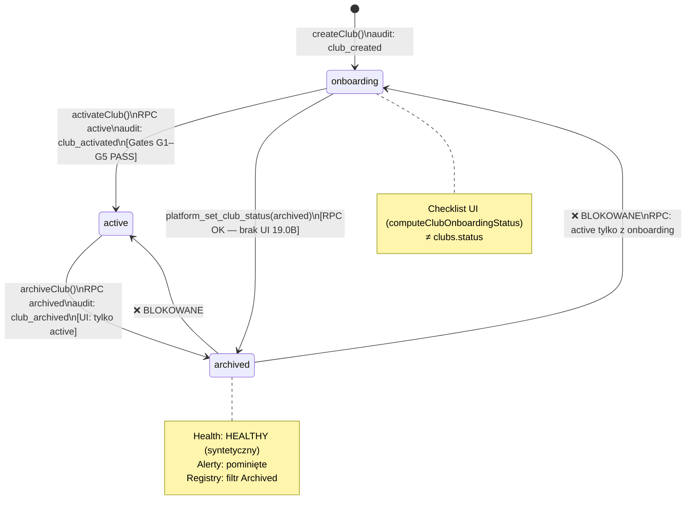

# Sprint 19.2A — Lifecycle Hardening Audit

**Data:** 2026-06-04  
**Typ:** audyt wyłącznie odczytowy — **bez** zmian kodu, migracji, RPC, commitów, deployów  
**Baseline:** 19.0B Club Operations Registry ✅ · 19.1 Club Attention Dashboard ✅  
**Tag referencyjny:** `pre-19-multi-club-operations` (+ lokalne 19.0B/19.1 bez commita w tej sesji)

---

## 1. Raport audytu (executive)

### Werdykt lifecycle

| Faza | Stan | Ocena |
|------|------|-------|
| **Utworzenie → onboarding** | ✅ Kompletne | `createClub()` + audit `club_created` + owner invite |
| **Onboarding → active** | ✅ Kompletne | Gates G1–G5 + `activateClub()` + audit `club_activated` |
| **active → archived** | ⚠️ Częściowe | RPC + UI Archive (19.0B) tylko dla `active`; RPC pozwala też `onboarding` → `archived` bez UI |
| **archived → active/onboarding** | ❌ Brak | RPC **blokuje** powrót; operator bez ścieżki odzyskania |
| **suspended (klub)** | ❌ Nie istnieje | Tylko `membership_status.suspended` |
| **test clubs** | ⚠️ Heurystyka | Slug patterns w alertach; brak flagi w danych / rejestrze |

**Czy operator może bezpiecznie zarządzać klubem od utworzenia do archiwizacji?**  
**Tak** — ścieżka create → league setup → activate → archive jest spójna i audytowana.

**Czy może bezpiecznie wykonać ponowną aktywację?**  
**Nie** — po archiwizacji klub jest terminalem bez UI ani RPC restore.

**Gotowość lifecycle end-to-end:** **~75%** (brakuje restore, owner recovery, test club management, opcjonalnie suspend).

### Rekomendacja Sprint 19.2B

**GO** — z wąskim zakresem hardeningu (bez nowych tabel):

1. Rozszerzenie **istniejącego** RPC `platform_set_club_status` o kontrolowane przejście `archived` → `onboarding` (restore).
2. `restoreClub` / `unarchiveClub` + UI + audit `club_restored`.
3. Owner resend invite (server action, bez nowego RPC DB).
4. `clubs.settings.isTest` (JSONB) + filtr w rejestrze (bez migracji kolumny).
5. Opcjonalnie: Archive dla `onboarding` w UI (zgodność z RPC).

**NO-GO** w 19.2B dla: `clubs.suspended` jako nowy status tenant — wymaga decyzji produktowej i szerszego wpływu na cron/public.

---

## 2. Lifecycle Map (Zadanie 1)

### Stany `clubs.status` (TEXT, bez enum DB)

| Stan | Jak powstaje | Public site | Cron mirror | Panel klubu (RBAC) |
|------|--------------|-------------|-------------|---------------------|
| **`onboarding`** | INSERT w `createClub()` | ❌ `resolvePublicClubBySlug` wymaga `active` | ❌ `league-club-config.mjs` filtruje `active` | ✅ jeśli membership |
| **`active`** | `activateClub()` z `onboarding` | ✅ `/{slug}` | ✅ | ✅ |
| **`archived`** | `archiveClub()` z `active` (UI) lub RPC z `active`/`onboarding` | ❌ | ❌ | ⚠️ Dane RBAC pozostają; operator nie ma „suspend” |

### `suspended` na poziomie klubu

**Nie istnieje** jako `clubs.status`.

Występuje w `membership_status` enum: `active | invited | suspended | archived` — dotyczy **użytkownika w klubie**, nie tenanta.

### Test clubs

Brak `clubs.is_test`. Wykrywanie heurystyczne (`isTestClubSlug`):

- `pilot-club-test`
- prefiks `release-184a-`
- prefiks `pilot-club-`

Użycie: **tylko** `platform-alerts.ts` (ukrycie alertów operacyjnych + INFO zbiorczy).  
**Nie** w: Club Registry, Attention Dashboard, health scoring.

### Diagram przejść



### Dwa modele postępu (ważne)

| Model | Gdzie | Wpływ lifecycle |
|-------|-------|-----------------|
| `clubs.status` | DB + RPC | Public, cron, health archived branch |
| Onboarding checklist | `onboardingByClubId` w Health context | UI gates, dashboard 19.1; **nie** zmienia statusu |

---

## 3. Archiwizacja (Zadanie 2)

### Łańcuch wywołań

```
UI Archive (club-operations-registry.tsx)
  → archiveClubAction (actions.ts)
    → archiveClub() (club-lifecycle.ts)
      → platformSetClubStatus(pg, clubId, 'archived', auditEntry)
        → RPC platform_set_club_status (SECURITY DEFINER)
          → SET fcos.platform_club_write = '1'
          → UPDATE clubs SET status, settings.platformAudit[], updated_at
```

### Warstwy walidacji

| Warstwa | Reguła |
|---------|--------|
| **UI 19.0B** | Przycisk tylko gdy `status === 'active'` |
| **TS `archiveClub`** | Odrzuca inne niż `active` (oprócz noop gdy już `archived`) |
| **RPC** | `archived` dozwolone z `active` **lub** `onboarding` |

**Niespójność:** operator nie może zarchiwizować klubu w onboardingu z UI, choć RPC to umożliwia (np. porzucenie testowego klubu bez aktywacji).

### Co się dzieje przy archiwizacji?

1. `clubs.status` → `archived`
2. Wpis audit `club_archived` w `clubs.settings.platformAudit[]` (wymagany `action` w RPC gdy audit przekazany)
3. `updated_at` odświeżony
4. `logPlatformAudit` + `console.info` po stronie serwera
5. `revalidatePath` dla `/platform`, `/platform/clubs`, `/platform/monitoring`, detail klubu

**Czego NIE robi archiwizacja:**

- Nie usuwa danych tenantowych (players, league_sources, sync jobs, memberships)
- Nie dezaktywuje `league_sources.is_active`
- Nie usuwa użytkowników Auth
- Nie zmienia slug

### Dane pozostające „aktywne”

| Obszar | Po archiwizacji |
|--------|-----------------|
| Wiersze DB klubu | ✅ Wszystkie tabele `club_id` |
| `league_sync_jobs` | ✅ Historia zachowana; nowe crony nie uruchamiają sync dla klubu |
| `club_memberships` | ✅ Bez zmian |
| `platform_sync_metrics` | ✅ Metryki historyczne w oknie 7d nadal liczone dla club_id |
| Audit Center | ✅ Wpisy w `settings` pozostają |

### Skutki dla monitoringu i alertów

| System | Zachowanie (`health.ts`, `platform-alerts.ts`) |
|--------|------------------------------------------------|
| **Club Health** | `evaluateClubHealth`: archived → score 100, level HEALTHY, factor „Klub zarchiwizowany” |
| **League Health** | archived → HEALTHY syntetyczny |
| **Platform Alerts** | `continue` — brak alertów operacyjnych dla archived |
| **Attention Dashboard 19.1** | `buildClubsRequiringAttention` pomija `archived` |
| **Registry** | Widoczny w filtrze Archived; brak przycisku Archive |

---

## 4. Unarchive (Zadanie 3)

### Stan backendu

`platform_set_club_status` akceptuje tylko target: `'active' | 'archived'`.

```sql
IF p_status = 'active' AND v_old_status <> 'onboarding' THEN
  RAISE EXCEPTION 'can only activate from onboarding';
```

Z **`archived`** nie ma legalnego przejścia.

### Ograniczenia biznesowe (dlaczego nie „archived → active” wprost)

1. **Gates aktywacji** — `activateClub` wymaga `onboarding` + G1–G5; przy restore z archiwum brakuje ponownej weryfikacji konfiguracji.
2. **Public safety** — bezpośredni `active` mógłby przywrócić public site bez sprawdzenia ligi/sync.
3. **Audit** — brak zdarzenia `club_restored` / `club_reactivated` w modelu.

### Czy potrzebne są zmiany RPC?

**Tak** — minimalna zmiana w **istniejącej** funkcji (19.2B może być migracja hotfix jak 18.4a-db, **bez nowej tabeli**):

**Rekomendowane rozwiązanie (preferowane):**

```
archived → onboarding  (restore / soft unarchive)
  + audit club_restored
  + opcjonalnie: wymóg platform admin confirm
onboarding → active    (istniejący flow + gates)
```

**Alternatywa (bardziej ryzykowna):**

```
archived → active
  + wymuszone evaluateClubActivationGates przed RPC
  + audit club_reactivated
```

**Nie implementować w audycie** — tylko projekt na 19.2B.

### UI dziś

`club-operations-registry.tsx` informuje operatora, że Unarchive wymaga Sprint 19.2 — zgodne z audytem.

---

## 5. Ownership (Zadanie 4)

### Model danych

- **`club_memberships`**: `role = owner`, `status ∈ {active, invited, suspended, archived}`
- **Lookup w rejestrze:** bulk `club_memberships` + `profiles.email` (`club-operations-registry.ts`)
- **Onboarding checklist:** krok `owner` = complete gdy `membership.status === 'active'`

### Invitation flow (`club-bootstrap.ts` → `ensureOwnerViaAuth`)

1. Szukaj użytkownika w Auth po email
2. Jeśli istnieje → `club_memberships` upsert `owner` + **`active`**
3. Jeśli nie → `inviteUserByEmail` → membership **`invited`**

### Czy klub może istnieć bez ownera?

**Teoretycznie tak** — jeśli `ensureOwnerViaAuth` się nie powiedzie po COMMIT transakcji bootstrap (edge case) lub membership zostanie usunięty ręcznie w DB.

**Praktycznie nie** przy happy path create — wizard wymaga `ownerEmail`.

**Aktywacja:** Gate G1 **FAIL** przy braku ownera lub `invited` — klub zostaje w `onboarding`.

### Jak operator wykryje brak ownera?

| Miejsce | Sygnał |
|---------|--------|
| Club Registry | Kolumna Owner: `—` lub `(invited)` |
| Club detail | Sekcja właściciel |
| Activation card | Gate G1 FAIL |
| Onboarding checklist | krok Owner ≠ complete |
| Attention Dashboard 19.1 | onboarding + „Brakuje: Właściciel” |

### Ponowne wysłanie zaproszenia?

**❌ Brak** — `inviteUserByEmail` tylko przy `createClub`. Brak `resendOwnerInviteAction` na detail klubu.

**Rekomendacja 19.2B:** server action z `admin.auth.admin.inviteUserByEmail` (lub magic link) + audit `owner_invite_resent` — **bez nowego RPC DB**.

---

## 6. Test Clubs (Zadanie 5)

### Gdzie heurystyki

| Lokalizacja | Zachowanie |
|-------------|------------|
| `platform-alerts.ts` `isTestClubSlug()` | Pomija alerty operacyjne per klub; jeden INFO zbiorczy |
| Registry / Dashboard / Health | **Brak** — test club z problemami sync pojawi się w attention |

### Wpływ dodania `is_test` (rekomendacja bez migracji kolumny)

**Proponowane:** `clubs.settings.isTest: boolean` ustawiane przy create (checkbox wizard) lub ręcznie przez operatora.

| Obszar | Wpływ |
|--------|--------|
| Registry | Filtr „Ukryj test”; domyślnie włączony dla operatora |
| Attention Dashboard | Wykluczenie z „wymagające uwagi” (jak alerty) |
| Health / metrics | Bez zmian (diagnostyka nadal możliwa w Monitoring) |
| Cron | Opcjonalnie: nigdy nie cronować `isTest` nawet gdy active — decyzja produktowa |
| Alerty | Zastąpienie heurystyki slug flagą + fallback slug |

**Bez nowej tabeli** — wystarczy JSONB `settings` + `platform_append_club_audit` przy zmianie flagi.

---

## 7. Audit Trail (Zadanie 6)

### Magazyn

`clubs.settings.platformAudit[]` — tablica `PlatformAuditEntry`:

```typescript
{ action, at, actorUserId, actorEmail, metadata? }
```

Odczyt: Platform Dashboard, **Audit Center** (`/platform/audit`) — flatten po wszystkich klubach.

Zapis lifecycle: przez RPC `platform_set_club_status` (status + audit atomowo) lub `platform_append_club_audit` (liga).

### Zdarzenia zdefiniowane (`platform-audit-actions.ts`)

| Action | Istnieje | Gdzie zapisywane | UI label |
|--------|----------|------------------|----------|
| `club_created` | ✅ | bootstrap transaction → settings | Utworzenie klubu |
| `league_configuration_saved` | ✅ | league-setup RPC path | Zapis konfiguracji ligi |
| `league_sync_activated` | ✅ | league-setup | Aktywacja sync ligi |
| `club_activated` | ✅ | `platform_set_club_status(active)` | Aktywacja klubu |
| `club_archived` | ✅ | `platform_set_club_status(archived)` | Archiwizacja klubu |

### Brakujące zdarzenia lifecycle

| Action | Potrzeba |
|--------|----------|
| `club_restored` / `club_unarchived` | Przy 19.2B restore |
| `club_reactivated` | Jeśli ścieżka archived → active |
| `owner_invite_resent` | Owner recovery |
| `club_marked_test` / `club_unmarked_test` | Test club management |
| `club_archived_from_onboarding` | Opcjonalnie rozróżnienie metadanych |

### Luki jakości audit

- Brak centralnego indeksu DB (tylko JSONB per klub) — skalowanie OK przy <50 klubów
- `club_created` logowany też przez `logPlatformAudit` **przed** transakcją (możliwy wpis bez rollback przy błędzie bootstrap — edge case)
- Audit Center nie filtruje po severity lifecycle

---

## 8. Operations Gaps i priorytety (Zadanie 7)

| Luka | Priorytet | Uzasadnienie |
|------|-----------|--------------|
| **Unarchive / restore** (`archived` → `onboarding`) | **P0** | Blokuje odzyskanie po błędnej archiwizacji; handoff wspomina archiwizację klubów testowych |
| **Owner resend invite** | **P0** | Gate G1 blokuje aktywację bez UI recovery |
| **RPC + UI spójność** (archive z `onboarding`) | **P1** | Porzucenie klubów testowych bez aktywacji |
| **`settings.isTest` + filtr registry/dashboard** | **P1** | Szum operacyjny; heurystyka slug krucha |
| **Audit: `club_restored`, `owner_invite_resent`** | **P1** | Pełny trail lifecycle |
| **`clubs.suspended` (tenant)** | **P2** | Wymaga semantyki cron/public; nie ma dziś |
| **Deactivate league_sources przy archive** | **P2** | Opcjonalna higiena; cron i tak filtruje `active` clubs |
| **Hard delete klubu** | **P2+** | Poza scope; brak wymagań |

---

## 9. Rekomendacja GO / NO-GO — Sprint 19.2B

### GO ✅

**Sprint 19.2B — Lifecycle Hardening (implementacja)** z zakresem:

| # | Element | Nowa tabela? | Nowe RPC? |
|---|---------|--------------|-----------|
| 1 | Hotfix `platform_set_club_status`: `archived` → `onboarding` | ❌ | ⚠️ Rozszerzenie istniejącego |
| 2 | `restoreClub()` + UI Unarchive + `club_restored` | ❌ | używa (1) |
| 3 | `resendOwnerInviteAction` + audit | ❌ | ❌ (Auth API) |
| 4 | `settings.isTest` + filtry registry/attention | ❌ | ❌ (`platform_append_club_audit` opcjonalnie) |
| 5 | Archive z `onboarding` w UI (opcjonalnie) | ❌ | ❌ |

**Warunki GO:**

- Jedna migracja hotfix SQL (wzór 18.4a-db), nie nowa tabela
- Ponowna aktywacja publiczna **wyłącznie** przez istniejący flow `onboarding` → `active` + gates
- Walidatory 190b, 191a, 186b bez regresji

### NO-GO ❌ (w 19.2B)

- Nowy status `clubs.suspended`
- Email/webhook alerts
- Alert history / ack
- Osobny Operations Center / nowe trasy poza rozszerzeniem detail + registry
- Hard delete tenant

### Szacowany wynik po 19.2B

Lifecycle end-to-end: **~90%** — pełna pętla create → active → archive → restore → re-activate z audit trail.

---

## Załącznik — kluczowe pliki

| Obszar | Pliki |
|--------|-------|
| RPC lifecycle | `supabase/migrations/20260604140000_hotfix_184adb_platform_club_writes.sql` |
| Archive | `club-lifecycle.ts`, `archiveClubAction`, `club-operations-registry.tsx` |
| Activate | `club-activation.ts`, `club-activation-card.tsx` |
| Create + owner | `club-bootstrap.ts` |
| Audit | `audit.ts`, `platform-audit-actions.ts`, `audit-center.ts` |
| Test heurystyka | `platform-alerts.ts` `isTestClubSlug` |
| Public / cron | `public-club.ts`, `scripts/lib/league-club-config.mjs` |

---

*Koniec audytu 19.2A — bez zmian w repozytorium poza tym dokumentem.*
