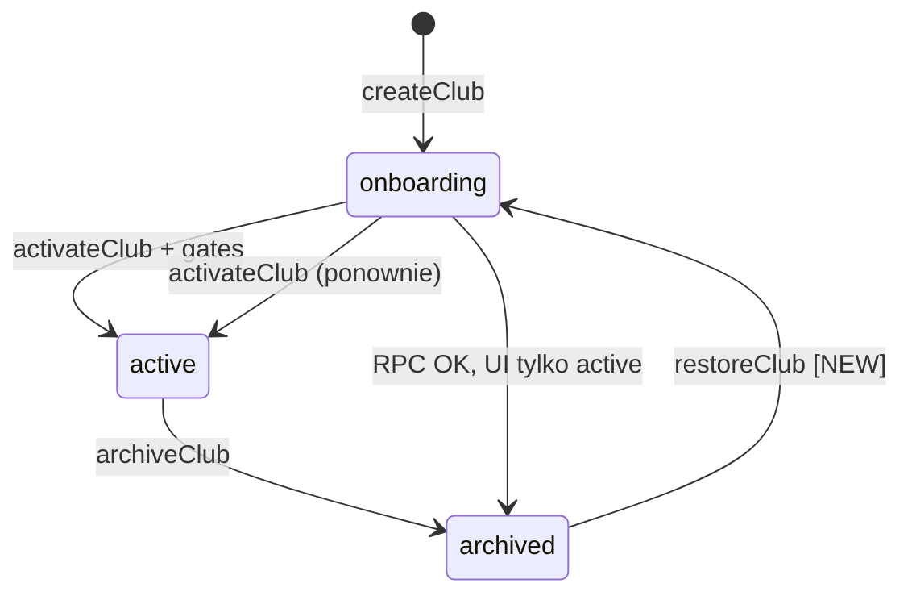

# Sprint 19.2B — Lifecycle Hardening (implementacja)

**Po audycie:** [sprint-192a-lifecycle-hardening-audit.md](./sprint-192a-lifecycle-hardening-audit.md)  
**Ograniczenia briefu:** brak nowych tabel, nowych RPC (nazw), migracji w `supabase/migrations/`, endpointów · **bez commita**

## Cel

Domknięcie lifecycle: restore z archiwum, owner resend, flaga test club, spójny audit.

## Zmienione / nowe pliki

| Plik | Zmiana |
|------|--------|
| `scripts/sql/hotfix-192b-platform-restore-club.sql` | Rozszerzenie **istniejącego** `platform_set_club_status` (`onboarding` z `archived`) |
| `src/lib/platform/club-db-writes.ts` | `PlatformClubTargetStatus` + `onboarding` |
| `src/lib/platform/club-lifecycle.ts` | `restoreClub`, `resendOwnerInvite`, refaktor transakcji |
| `src/lib/platform/club-test.ts` | `isTestClub`, `settings.isTest`, fallback slug |
| `src/lib/platform/platform-audit-actions.ts` | `club_restored`, `owner_invite_resent` |
| `src/lib/platform/health.ts` | `settings` w kontekście klubów |
| `src/lib/platform/platform-alerts.ts` | `isTestClub` + `settings.isTest` (lokalna kopia logiki z `club-test.ts` — kompatybilność z validate-186b) |
| `src/lib/platform/club-operations-registry.ts` | `isTest`, filtr attention |
| `src/lib/platform/dashboard.ts` | pomijanie test clubs w attention |
| `src/lib/platform/club-bootstrap.ts` | `isTest` przy create |
| `src/features/platform/actions.ts` | `restoreClubAction`, `resendOwnerInviteAction`, `isTest` w create |
| `src/features/platform/components/club-operations-registry.tsx` | Restore, Resend, ukryj test |
| `src/features/platform/components/create-club-wizard.tsx` | checkbox klub testowy |
| `scripts/validate-192b-lifecycle-hardening.mjs` | Walidator |
| `docs/architecture/sprint-192b-lifecycle-hardening-*.md` | Raporty |

## Zadanie 1 — Unarchive (archived → onboarding)

- `restoreClub()` → `platformSetClubStatus(..., 'onboarding', audit club_restored)`
- **Nie** `archived → active` (gates aktywacji bez zmian)
- **Wymagane na DB:** ręczne zastosowanie `scripts/sql/hotfix-192b-platform-restore-club.sql` (brak pliku w `supabase/migrations/` zgodnie z briefem)

## Zadanie 2 — UI Restore

- Przycisk **Restore** dla `status === archived` w Club Operations Registry
- Modal potwierdzenia → `restoreClubAction` → `router.refresh()`

## Zadanie 3 — Owner Resend

- `resendOwnerInvite()` — `admin.auth.admin.inviteUserByEmail` (ten sam mechanizm co `createClub`)
- Tylko gdy `ownerStatus !== 'active'`
- Audit: `owner_invite_resent` via `platform_append_club_audit`
- **Blokada:** Supabase może odrzucić ponowne invite dla tego samego użytkownika — komunikat błędu w UI (bez nowej infrastruktury)

## Zadanie 4 — Test clubs (`settings.isTest`)

- Przy tworzeniu klubu: checkbox → `settings.isTest: true`
- `isTestClub(slug, settings)` = flaga **lub** heurystyka slug
- Registry: badge `test`, checkbox „Ukryj kluby testowe”, `requiresAttention` false dla test
- Attention Dashboard + Alerts: pomijanie test (z fallback slug)

## Wpływ na lifecycle

## Analiza zapytań

Brak nowych loaderów. Restore/resend = 1× istniejący flow PG + Auth (jak archive). `settings` w health context = +0 zapytań (pole w istniejącym SELECT clubs).
