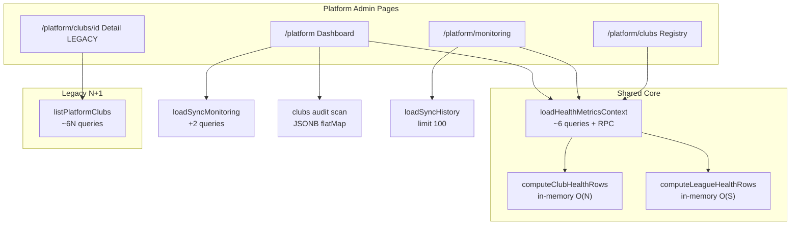

# Sprint 19.3A — SaaS Readiness Audit

**Data:** 2026-06-05  
**Typ:** audyt wyłącznie odczytowy — **bez** zmian kodu, migracji, RPC, commitów, deployów  
**Baseline:** tag `pre-19-3-saas-readiness-audit` · 19.0B Registry ✅ · 19.1 Attention Dashboard ✅ · 19.2B Lifecycle ✅

---

## 1. Executive Summary

FC OS ma **solidny fundament operacyjny** dla multi-club (Health v2, bulk context, Registry, Attention, Lifecycle restore). Ścieżki **19.0B+** są zaprojektowane bez N+1 per klub.

Największe ryzyko skalowania to **legacy loader** `listPlatformClubs()` / `getPlatformClubDetail()` (szczegóły klubu), **brak paginacji** na widokach operacyjnych oraz **audit w JSONB** (`settings.platformAudit`) bez limitu wzrostu.

| Skala | Werdykt | GO / NO-GO |
|-------|---------|------------|
| **20 klubów** | GREEN | **GO** |
| **50 klubów** | YELLOW | **GO** z planem P0 przed intensywną pracą operatora |
| **100 klubów** | RED | **NO-GO** bez P0 (szczególnie detail + paginacja + audit) |

---

## 2. Ranking ryzyk (Zadanie 1 — Query Audit)

| # | Ryzyko | Severity | Gdzie | Wzrost |
|---|--------|----------|-------|--------|
| **R1** | `getPlatformClubDetail()` ładuje **wszystkie** kluby przez `listPlatformClubs()` | **P0 / CRITICAL** | `/platform/clubs/[clubId]` | **O(N²)** zapytań (~6×N na listę + 6×N na detail) |
| **R2** | Brak paginacji — pełna lista klubów + health w HTML | **P0 / HIGH** | Registry, Monitoring health tables | O(N) payload + render |
| **R3** | `platformAudit` w JSONB — pełny scan wszystkich klubów | **P0 / HIGH** | Dashboard `recentActions`, Audit Center | O(N × wpisy/klub) |
| **R4** | Duplikacja `clubs` + `league_sync_jobs` między loaderami | **P1 / MEDIUM** | Dashboard, Monitoring | stały mnożnik ~2–3× na request |
| **R5** | Brak `cache()` / współdzielenia kontekstu między stronami RSC | **P1 / MEDIUM** | Każda nawigacja Platform Admin | pełny cold load |
| **R6** | `ensureOwnerViaAuth` → `listUsers({ perPage: 1000 })` | **P1 / MEDIUM** | `createClub()` | O(auth users), limit 1000 |
| **R7** | `website_media` bulk `.in(club_id)` bez agregacji SQL | **P2 / LOW** | `buildOnboardingByClubId` | O(media rows) |
| **R8** | `platform_sync_metrics` scan 7d `league_sync_jobs` | **P2 / LOW–MED** | Health context | O(jobs w oknie) ≈ O(kluby × freq sync) |
| **R9** | Resend invite — brak gwarancji Auth przy duplikacie email | **P2 / OPS** | Registry lifecycle | pojedyncze akcje, nie skala list |

### Co działa dobrze (post-19.0B)

- **Registry** (`loadClubOperationsRegistry`): 1× `loadHealthMetricsContext` + 2× bulk owner — **bez N+1**.
- **Attention Dashboard** (`loadPlatformDashboard`): 1× context, onboarding bulk w context — **bez** per-klub `computeClubOnboardingStatus`.
- **Monitoring bundle**: 1× context + sync history — health bez dodatkowych zapytań per klub.
- **Alerts** (`evaluatePlatformAlerts`): czysto in-memory na gotowych wierszach — O(N) akceptowalne do ~100.

---

## 3. Analiza wydajności — Health & Monitoring (Zadanie 2)

### `loadHealthMetricsContext()` — rdzeń platformy

Jedno ładowanie = **~6 round-tripów**:

| Krok | Zapytanie | Skala |
|------|-----------|-------|
| 1 | `platform_sync_metrics(NULL, NULL, 7)` (pg) | RPC agreguje joby 7d per `club_id` |
| 2 | `clubs` SELECT (wszystkie) | O(N) |
| 3 | `league_sources` SELECT (wszystkie) | O(N) typ. 1–2 źródła/klub |
| 4–6 | `website_settings`, `club_memberships` (owner), `website_media` bulk `.in(club_id)` | O(N) |

**Wniosek:** architektura **wytrzyma 100 klubów** na warstwie health context (~6 zapytań), o ile RPC i tabele jobów pozostają w rozsądnym rozmiarze. Wąskie gardło to **wolumen `league_sync_jobs`** (cron × aktywne kluby), nie sama liczba klubów w SELECT.

### `computeClubHealthRows` / `computeLeagueHealthRows`

- Czysta iteracja in-memory po context — **O(N)** / **O(sources)**.
- Przy 100 klubach: <1 ms CPU; nie jest problemem.

### `evaluatePlatformAlerts`

- Iteracja `clubHealth` + `leagueHealth` + dedupe — **O(N + S)**.
- Przy 100 klubach: akceptowalne; dedupe redukuje szum UI.

### Sync History (`loadSyncHistory`, limit 100)

- 1× PostgREST z embedami (`clubs`, `league_competitions`, `league_sources`).
- Koszt **stały** (nie rośnie z N klubów) — OK.

### `loadSyncMonitoring` (limit 50)

- Osobny fetch `clubs` + 50 jobów — **duplikuje** dane z context na Dashboard/Monitoring.

### Czy wytrzyma 100 klubów?

| Komponent | 20 | 50 | 100 |
|-----------|----|----|-----|
| Health context | ✅ | ✅ | ✅ (z monitoringiem jobów) |
| Monitoring page | ✅ | ✅ | ⚠️ duży HTML health tables |
| Dashboard | ✅ | ✅ | ⚠️ duplikacja zapytań |
| Club detail | ✅ | ❌ | ❌ R1 |

**Miejsca rosnące liniowo:** `clubs` rows, `league_sources` rows, onboarding bulk, alert raw collection, registry rows, audit JSON parse, sync job volume (operacyjnie).

---

## 4. Club Registry — `/platform/clubs` (Zadanie 3)

### Implementacja

```
loadClubOperationsRegistry()
  → loadHealthMetricsContext()     // 1×
  → computeClubHealthRows(ctx)     // in-memory
  → loadOwnerByClubId(all ids)     // 2× bulk
  → merge + sort
```

**Ukryte N+1:** **brak** na ścieżce rejestru (19.0B).

### Wyszukiwanie i filtry

- **Server:** pełny dataset.
- **Client:** `useMemo` filter po `publicName`, `slug`, status, attention, hide test — **O(N)** na każde naciśnięcie klawisza (akceptowalne do ~100).

### Owner lookup

- Bulk: `club_memberships` + `profiles` — poprawne.

### Health integration

- Z `computeClubHealthRows` — spójne z Monitoring.

### Luki operacyjne (nie wydajność)

- Brak server-side search / paginacji.
- Cała tabela w DOM — przy 100+ wierszach UX i TTFB rosną.

---

## 5. Dashboard — `/platform` (Zadanie 4)

### `loadPlatformDashboard()` — zapytania

Na jeden request:

1. `loadHealthMetricsContext()` — ~6 zapytań (patrz §3)
2. Równolegle:
   - `loadSyncMonitoring()` — **+2** (`clubs` ponownie, 50 jobów)
   - `league_sources` count head
   - `league_sync_jobs` limit 10
   - `clubs` id/slug/status/settings — **trzeci** fetch clubs
   - `computeClubHealthRows` + `computeLeagueHealthRows`

**Szacunek:** **~10–11** round-tripów DB + 1× pg RPC na jeden dashboard.

### Duplikacja danych

| Dane | Ile razy na dashboard |
|------|------------------------|
| `clubs` | 3× (context, sync monitoring, audit) |
| `league_sync_jobs` | 2× (10 + 50 w monitoring helper) |
| Health rows | 2× compute (club + league) — tanie in-memory |

### Cache

- Brak `unstable_cache` / `React.cache()` na `loadHealthMetricsContext`.
- Każde odświeżenie `/platform` = pełny koszt.
- **Możliwość cache:** context TTL 30–60 s wystarczyłby dla operatora; wymaga implementacji (P1).

### Attention sections (19.1)

- `clubsRequiringAttention` — max 10, pomija test clubs ✅
- `topAlerts` — max 5 ✅
- `onboardingNeedingAction` — max 10 ✅
- `recentActions` — scan **wszystkich** `platformAudit` w JSONB, potem slice 15 ⚠️

---

## 6. Owner Lifecycle (Zadanie 5)

| Flow | Implementacja | Skala 100 klubów |
|------|---------------|------------------|
| **Create owner** | `inviteUserByEmail` lub upsert z `listUsers(1000)` | ⚠️ listUsers nie skaluje >1000 kont Auth |
| **Invite owner** | Supabase Auth invite + `club_memberships.status=invited` | OK per akcja |
| **Resend invite** | `resendOwnerInvite()` — ten sam invite | ⚠️ Auth może odrzucić duplikat (udokumentowane) |
| **Owner missing** | Registry pokazuje `ownerEmail=null` / status | OK wizualnie; brak bulk „clubs without active owner” report |

**Gotowość:** operacje **jednostkowe** są OK; **masowe tworzenie** klubów (onboarding 50+ ownerów) wymaga zamiany `listUsers` na `getUserByEmail` / lookup po `profiles` (P1).

---

## 7. Multi-Tenant Readiness (Zadanie 6)

### 20 klubów — **GREEN** · **GO**

- Health context ~6 zapytań, RPC na ~140–700 jobów/tydzień (przy daily cron).
- Registry i Dashboard responsywne.
- Legacy detail page: ~120 zapytań przy wejściu w 1 klub — tolerowalne przy rzadkim użyciu.
- Audit JSONB mały.

### 50 klubów — **YELLOW** · **GO** (warunkowy)

- Dashboard ~10 zapytań OK; TTFB może rosnąć do 1–3 s bez cache.
- Detail page: **~300 zapytań** na jedno wejście — **nieakceptowalne** przy codziennej pracy.
- `listUsers(1000)` przy create — zbliżanie do limitu Auth API.
- Audit Center: parse wszystkich JSONB zaczyna być odczuwalny.

**Warunek GO:** zaplanować P0 przed utrzymaniem 50 klubów aktywnych operacyjnie.

### 100 klubów — **RED** · **NO-GO**

- Detail: **~600+ zapytań** na page view.
- Registry/Monitoring: pełne tabele 100 wierszy + health — ciężki HTML, brak paginacji.
- `platformAudit` w JSONB — ryzyko wielu MB `settings`, wolny Audit Center.
- `league_sync_jobs` — przy daily cron ~700 rekordów/tydzień na 100 klubów (OK); przy częstszym sync — RPC wolniejszy.
- Brak cache = każdy operator refresh mnoży obciążenie.

**Bez P0:** NO-GO dla produkcyjnego SaaS na 100 klubów.

---

## 8. Roadmapa priorytetów (Zadanie 7)

### P0 — konieczne przed skalowaniem (50–100)

1. **Naprawa `getPlatformClubDetail`** — pojedynczy klub, bulk onboarding (reuse `buildOnboardingByClubId` lub 1 club query); **usunąć** wywołanie `listPlatformClubs()` z detail.
2. **Paginacja server-side** — Registry (i opcjonalnie Monitoring health tables): `limit/offset` lub cursor.
3. **Audit trail** — limit wpisów w `platformAudit` (np. ostatnie 50/klub) lub migracja do tabeli audit (decyzja produktowa); Audit Center z SQL filter zamiast full JSON scan.
4. **Deprecacja `fetchPlatformClubs` / `listPlatformClubs`** na rzecz Registry loader tam, gdzie jeszcze używane.

### P1 — ważne (komfort 50 klubów, przygotowanie 100)

1. **`React.cache(loadHealthMetricsContext)`** lub krótki TTL cache współdzielony między dashboard/registry/monitoring w jednym request tree.
2. **Dedup zapytań na Dashboard** — jeden fetch `clubs`, jeden fetch recent jobs (usunąć triple clubs).
3. **`ensureOwnerViaAuth`** — `getUserByEmail` zamiast `listUsers(1000)`.
4. **Server-side search** w Registry (opcjonalnie ILIKE po slug/name).
5. **Retencja `league_sync_jobs`** — polityka archiwizacji >90 dni (cron volume).

### P2 — później

1. Materialized view / scheduled job dla health summary KPI.
2. Dedykowana tabela `platform_audit_log` + indeksy (club_id, at, action).
3. Edge/cache dla read-only platform routes.
4. Bulk report „owners invited >7d” bez otwierania Registry.
5. Webhook/email alerts (poza zakresem dotychczasowych sprintów).

---

## 9. GO / NO-GO — podsumowanie

| Skala | Multi-Tenant | Performance | Operations | Werdykt |
|-------|--------------|-------------|------------|---------|
| **20** | GREEN | GREEN | GREEN | **GO** |
| **50** | YELLOW | YELLOW | GREEN | **GO** (z P0 w backlogu) |
| **100** | RED | RED | YELLOW | **NO-GO** (do P0) |

---

## 10. Diagram — przepływ zapytań (stan obecny)



---

## 11. Deliverables checklist

| # | Deliverable | Lokalizacja |
|---|-------------|-------------|
| 1 | Raport SaaS Readiness | ten dokument |
| 2 | Ranking ryzyk | §2 |
| 3 | Analiza wydajności | §3, §5 |
| 4 | Analiza Multi-Tenant | §7 |
| 5 | P0 / P1 / P2 | §8 |
| 6 | GO / NO-GO 20/50/100 | §1, §9 |

---

## 12. Referencje kodu

| Moduł | Plik |
|-------|------|
| Health context | `src/lib/platform/health.ts` |
| Dashboard | `src/lib/platform/dashboard.ts` |
| Registry | `src/lib/platform/club-operations-registry.ts` |
| Monitoring bundle | `src/lib/platform/health.ts` `loadPlatformMonitoringBundle` |
| Alerts | `src/lib/platform/platform-alerts.ts` |
| Sync metrics RPC | `supabase/migrations/20260704120000_sprint_185a_league_sync_foundation.sql` |
| Legacy N+1 | `src/lib/platform/onboarding-status.ts` |
| Club detail | `src/app/(platform)/platform/clubs/[clubId]/page.tsx` |
| Owner create | `src/lib/platform/club-bootstrap.ts` `ensureOwnerViaAuth` |
| Audit Center | `src/lib/platform/audit-center.ts` |
| Lifecycle | `src/lib/platform/club-lifecycle.ts` |

**Status audytu:** zakończony · **bez zmian w kodzie** · **bez commita**
