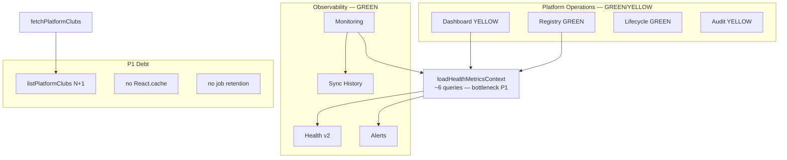

# Sprint 20.0A — Platform Scale Review

**Data:** 2026-06-05  
**Typ:** audyt wyłącznie odczytowy — **bez** zmian kodu, migracji, commitów, deployów  
**Baseline:** tag `pre-20-platform-scale-review` (`351b424`)  
**Faza zamknięta:** 18.5A → 18.5D · 18.6B/C · 19.0B · 19.1 · 19.2B · 19.3A/B  
**Hotfixy Supabase:** `hotfix-192b-platform-restore-club.sql` ✅ · `hotfix-193b-platform-audit-prune.sql` ✅

---

## 1. Executive Summary

FC OS ma **dojrzały fundament operacyjny** Platform Admin: Health v2, Monitoring, Alerts, Registry, Attention Dashboard, Lifecycle (create → activate → archive → restore), audit z limitem 100.

Po **19.3B P0** platforma jest **GO warunkowy do ~100 klubów** operacyjnie. Główne wąskie gardła to nadal **pełny health context na każdy request**, **legacy `listPlatformClubs` N+1** (server action), **brak cache** oraz **brak retencji sync jobs** — nie blokuje 20–50 klubów, ale limituje 500.

**Rekomendacja strategiczna:** Sprint **20.1 = Scale & Performance P1** (cache health context, dedup dashboard, `getUserByEmail`, sync jobs retention).

---

## 2. Architecture Health Matrix (Zadanie 1)

| Moduł | Status | Uzasadnienie |
|-------|--------|--------------|
| **Dashboard** (`/platform`) | **YELLOW** | Attention sections dobre (top 10/5); nadal ~10–11 zapytań/request, 3× fetch `clubs`, brak cache. KPI i alerty działają. |
| **Club Registry** (`/platform/clubs`) | **GREEN** | Paginacja 25/50/100, bulk health + owners, filtry server-side. Koszt: pełny health context przy każdym load (akceptowalne do 100). |
| **Lifecycle** | **GREEN** | create / activate / archive / restore / resend invite; audit `club_*` + `owner_invite_resent`; hotfix restore na DB. Brak `suspended` klubu — poza zakresem. |
| **Monitoring** (`/platform/monitoring`) | **GREEN** | Bundle: context + alerts (full) + health paginacja + sync history (100). Cron card OK. |
| **Health v2** | **GREEN** | `loadHealthMetricsContext` + `platform_sync_metrics` RPC — spójny rdzeń; ~6 round-tripów stałych. Skaluje liniowo z N klubów i job volume. |
| **Alerts** (18.6B/C) | **GREEN** | Dedupe, factors, test club filter (`settings.isTest` + slug), priority sort. In-memory O(N) — OK do 100+. |
| **Sync History** (18.5C) | **GREEN** | 1× query, limit 100, embedy — koszt stały. |
| **Audit** (Center + JSONB) | **YELLOW** | Prune 100/klub (TS + RPC hotfix ✅). Audit Center nadal: SELECT wszystkich klubów + flatMap JSONB (O(N×100)). Brak tabeli audit — świadomy dług. |

### Podsumowanie macierzy

| GREEN | YELLOW | RED |
|-------|--------|-----|
| 6 | 2 | 0 |

**Brak modułu RED** po fazie 18.5–19.3 + hotfixach.

---

## 3. Technical Debt Matrix (Zadanie 2)

| ID | Dług | Priorytet | Stan po 19.3B |
|----|------|-----------|---------------|
| **TD-1** | `listPlatformClubs()` N+1 (~6N) w `fetchPlatformClubs` | **P1** | Nadal aktywne; detail naprawiony, action nie |
| **TD-2** | Registry/Monitoring: pełny `loadHealthMetricsContext` przed slice paginacji | **P1** | Payload OK; CPU/DB scan O(N) pozostaje |
| **TD-3** | Dashboard: 3× fetch `clubs`, 2× `league_sync_jobs` | **P1** | Bez zmian |
| **TD-4** | Brak `React.cache` / TTL na health context | **P1** | Bez zmian |
| **TD-5** | `ensureOwnerViaAuth` → `listUsers(1000)` | **P1** | Limit Auth przy masowym onboardingu |
| **TD-6** | Audit Center: full-club scan JSONB | **P1** | Odczyt trim 100; scan klubów bez zmian |
| **TD-7** | Brak retencji `league_sync_jobs` | **P1** | RPC `platform_sync_metrics` rośnie z historią jobów |
| **TD-8** | Hotfixy SQL poza `supabase/migrations/` | **P2** | `192b`, `193b` — wymagają ręcznego apply na nowych env |
| **TD-9** | `website_media` bulk bez agregacji SQL | **P2** | Niski wpływ do 100 klubów |
| **TD-10** | Duplikacja `isTestClub` logiki (`club-test.ts` vs `platform-alerts.ts`) | **P2** | Kompatybilność Node validators |
| **TD-11** | Resend invite — Auth może blokować duplikat | **P2** | Ops, nie skala |
| **TD-12** | Brak `clubs.status = suspended` | **P2** | Produktowa decyzja |
| **TD-13** | Materialized health KPI / dedykowana tabela audit | **P2** | Potrzebne przy 200+ |

### P0 z 19.3A — status

| P0 | Status |
|----|--------|
| Detail N+1 | ✅ 19.3B |
| Paginacja Registry | ✅ 19.3B |
| Paginacja Monitoring health | ✅ 19.3B |
| Audit growth cap | ✅ 19.3B + hotfix DB |

---

## 4. Scale Assessment (Zadanie 3)

| Skala | Werdykt | Uzasadnienie | Główne ograniczenia |
|-------|---------|--------------|---------------------|
| **20** | **GO** | ~6 zapytań/detail; registry 25/strona; monitoring 50 health; 2 prod + test kluby OK | — |
| **50** | **GO** | Health context ~6 RT; TTFB 1–2 s bez cache tolerowalne; operator workflow kompletny | Dashboard dedup; listUsers przy wielu create |
| **100** | **GO warunkowy** | P0 zamknięte; paginacja ogranicza HTML; audit cap 100 | Pełny health scan/request; Audit Center O(N); brak job retention |
| **500** | **NO-GO** | Health context + onboarding bulk + alerts O(N) + JSONB audit scan + job table volume | Wymaga: cache/materialized views, audit table, job archiwizacja, ewentualnie shard read replica |

### Szacunek zapytań (po 19.3B)

| Strona | 20 klubów | 100 klubów |
|--------|-----------|------------|
| Club detail | ~6 | ~6 |
| Registry page | ~8 (+ context O(20)) | ~8 (+ context O(100)) |
| Dashboard | ~10–11 | ~10–11 |
| Monitoring | ~9 (+ alert eval O(N)) | ~9 (+ alert eval O(100)) |

---

## 5. Product Gap Analysis (Zadanie 4)

| Obszar | Dojrzałość | Największe luki |
|--------|------------|-----------------|
| **Platform Operations** | **Wysoka** | Brak bulk actions (mass archive, export CSV); brak „operations queue” |
| **Monitoring** | **Wysoka** | Brak email/webhook alertów; brak alert history; brak SLA dashboard |
| **Club Lifecycle** | **Wysoka** | Brak `suspended`; archive tylko z `active` w UI (RPC pozwala onboarding→archived) |
| **Owner Lifecycle** | **Średnia** | Resend invite ograniczony Auth; brak raportu „owners invited >7d”; `listUsers` przy create |
| **Onboarding** | **Wysoka** | Gates G1–G5 + checklist; brak wizarda end-to-end w jednym flow (rozproszone strony) |
| **League Management** | **Średnia–wysoka** | Wizard per klub OK; brak widoku federacji / multi-league portfolio; brak cross-club league health summary |

### Luki produktowe P0 biznesowe (nie techniczne)

1. **Operator nie dostaje alertu poza UI** (email/Slack) — ryzyko przegapienia CRITICAL.
2. **Brak raportu ownerów oczekujących** — utrudnia skalowanie onboardingu.
3. **Brak tenant `suspended`** — tylko archive (odwracalny przez restore) lub pełna aktywność.

---

## 6. Roadmap Options (Zadanie 5)

### A. Scale & Performance

| | |
|--|--|
| **Wartość biznesowa** | **Wysoka** — odblokowuje pewne GO na 100+ klubów, skraca TTFB, redukuje koszt Supabase/Vercel |
| **Ryzyko** | **Niskie** — refaktor loaderów, cache, retention; bez zmian produktu |
| **Złożoność** | **Średnia** (1–2 sprinty): cache, dedup dashboard, deprecate listPlatformClubs, job retention SQL |

### B. Club Management

| | |
|--|--|
| **Wartość biznesowa** | **Średnia–wysoka** — lepsza codzienna praca operatora, mniej ręcznych obejść |
| **Ryzyko** | **Średnie** — `suspended` wpływa na cron/public/RBAC; wymaga decyzji produktowej |
| **Złożoność** | **Średnia–wysoka**: suspended status, bulk owner report, archive z onboarding UI, export |

### C. League Ecosystem

| | |
|--|--|
| **Wartość biznesowa** | **Wysoka długoterminowo** — diferencjacja SaaS (liga jako core value) |
| **Ryzyko** | **Wysokie** — integracje, multi-provider, dane zewnętrzne |
| **Złożoność** | **Wysoka** (3+ sprinty): federation view, portfolio health, automated league onboarding |

---

## 7. P1 Backlog Review (Zadanie 6)

Źródło: [sprint-193a-saas-readiness-audit.md](../archive/19-3-scale/sprint-193a-saas-readiness-audit.md) §8 P1.

| Rekomendacja P1 | Nadal aktualna? | Uwagi po 19.3B |
|-----------------|-----------------|----------------|
| `React.cache(loadHealthMetricsContext)` | **TAK** | Największy quick win; paginacja nie rozwiązała cold scan |
| Dedup zapytań Dashboard | **TAK** | 3× clubs nadal |
| `getUserByEmail` zamiast `listUsers(1000)` | **TAK** | Krytyczne przy >50 nowych ownerów |
| Server-side search Registry (SQL ILIKE) | **CZĘŚCIOWO** | Jest `q` server-side na zbudowanym zbiorze; SQL-level przy 500 klubach |
| Retencja `league_sync_jobs` | **TAK** | Coraz ważniejsze wraz z liczbą klubów × cron |
| Deprecacja `listPlatformClubs` | **TAK** | Zostało w `fetchPlatformClubs` |
| Audit Center SQL filter | **TAK** (P2→P1 przy 100+) | Trim 100 pomaga; scan klubów zostaje |

**P2 nadal odłożone:** materialized KPI, tabela audit, edge cache, webhook alerts.

---

## 8. Strategic Recommendation — Sprint 20.1 (Zadanie 7)

### Rekomendacja: **20.1 — Platform Performance P1**

**Scope (propozycja):**

1. **`React.cache` + opcjonalny TTL** na `loadHealthMetricsContext` (współdzielenie w request tree).
2. **Dashboard query dedup** — jeden fetch `clubs`, jeden recent jobs.
3. **`getUserByEmail`** w `ensureOwnerViaAuth` (usunięcie `listUsers(1000)`).
4. **Deprecacja `listPlatformClubs`** — `fetchPlatformClubs` → thin wrapper lub usunięcie.
5. **`league_sync_jobs` retention** — skrypt SQL / cron cleanup >90 dni (bez nowej tabeli).

**Dlaczego nie Club Management ani League Ecosystem jako 20.1?**

| Kryterium | Scale P1 | Club Mgmt | League Eco |
|-----------|----------|-----------|------------|
| Wartość przy 20–50 klubach | Natychmiastowa (TTFB, koszt) | Przydatna, nie blokująca | Długi horyzont |
| Gotowość architektury | P1 domyka lukę 100 klubów | Wymaga decyzji `suspended` | Wymaga większego designu |
| Wpływ na skalowanie | **Bezpośredni** | Pośredni | Pośredni długoterminowo |
| Ryzyko regresji | Niskie | Średnie | Wysokie |

**20.2 (kandydat):** Club Management — owner pending report, archive z onboarding, export registry.  
**20.3+ (kandydat):** League Ecosystem lub Alerts v2 (email/webhook).

---

## 9. Diagram — stan architektury (post-19.3B)

---

## 10. Deliverables checklist

| # | Deliverable | Sekcja |
|---|-------------|--------|
| 1 | Platform Scale Review Report | §1 |
| 2 | Architecture Health Matrix | §2 |
| 3 | Technical Debt Matrix | §3 |
| 4 | Scale Assessment | §4 |
| 5 | Product Gap Analysis | §5 |
| 6 | Roadmap Options | §6 |
| 7 | Rekomendacja Sprintu 20.1 | §8 |

---

## 11. Werdykt końcowy

| Pytanie | Odpowiedź |
|---------|-----------|
| Czy FC OS jest gotowe do dalszego skalowania? | **TAK** do ~100 klubów (GO warunkowy); **NIE** do 500 bez P1+ |
| Który kierunek daje największą wartość teraz? | **A. Scale & Performance (P1)** |
| Co powinno być Sprintem 20.1? | **Platform Performance P1** — cache, dedup, owner lookup, job retention |

**Status audytu:** zakończony · **bez zmian w kodzie** · **bez commita**
