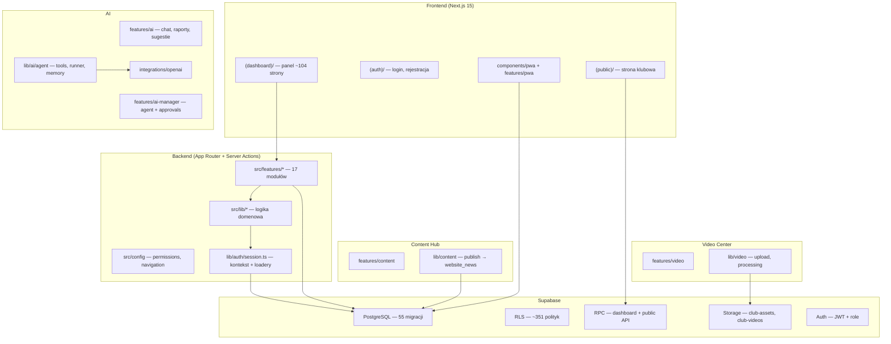

# Audyt konsolidacji ETAP 15.5 — Football Club OS

**Data:** 2026-05-31  
**Zakres:** ETAPY 1–15A — jakość kodu, architektura, dług techniczny, utrzymywalność  
**Status:** ✅ konsolidacja wykonana (bez nowych funkcji)

Powiązane: [raport ETAP 15.5](../stage-15.5-report.md)

---

## 1. Mapa architektury

### 1.1 Warstwy systemu

### 1.2 Moduły i zależności

| Moduł | Trasy | Lib | Zależy od |
|-------|-------|-----|-----------|
| Core | dashboard, club, teams, members, profile, settings | club/names | foundation RLS |
| Players | players/* | players/mappers | session loaders |
| Training | training/* | training/mappers | matches (ranking) |
| Matches | matches/* | matches/mappers | integrations (tabela) |
| AI Assistant | ai/chat, ai/reports, ai/suggestions | lib/ai/* | context → wszystkie insights |
| AI Manager | ai/manager, ai/tasks | lib/ai/agent/* | tools → matches, training, content, video |
| Sponsors | sponsors/* | sponsors/insights | finance (przychody) |
| Finance | finance/* | finance/insights | AI reports |
| Inventory | inventory/* | inventory/insights | finance (raporty) |
| Website CMS | website/* | website/* | storage, public-data |
| Integrations | integrations/* | integrations/* | matches sync |
| Academy | academy/* | academy/loaders | players, scouting |
| PWA | api/pwa/*, components/pwa | lib/pwa/* | stage12 + stage1310 RPC |
| Video | video/* | lib/video/* | AI processing, storage RLS |
| Content | content/* | lib/content/* | website publish, video context |
| Public | aktualnosci, druzyna, … | website/public-data | public RPC |

**Hotspot coupling:** `lib/auth/session.ts` (~2900 linii) — centralny hub loaderów dla wszystkich modułów. Rekomendacja na ETAP 15B: rozbicie na `lib/loaders/*.ts` per moduł.

**Most publikacji treści (3 ścieżki — do ujednolicenia w przyszłości):**

1. `website_news` — CMS ETAP 9  
2. `sponsor_publications` — ETAP 6  
3. `content_posts` + `content_channel_variants` — ETAP 15A → `publishContentToWebsite`

---

## 2. Duplicated code review

### 2.1 Znalezione duplikacje

| # | Obszar | Pliki | Status ETAP 15.5 |
|---|--------|-------|------------------|
| D1 | slugify | content/mappers, website/mappers | ✅ `lib/strings.ts` → `slugifyTitle` |
| D2 | readString | 6× features/*/actions.ts | ✅ `lib/form-data.ts` |
| D3 | Mapper row helpers | content, academy, inventory mappers | ✅ `lib/mappers/row-helpers.ts` |
| D4 | Dashboard stats grid | finance, inventory, sponsors, content, video | ✅ `components/ui/stats-grid.tsx` |
| D5 | AI report actions | features/ai/actions (3× generate*) | 📋 Raport — do ETAP 15B |
| D6 | AI report agent | lib/ai/agent/tools/write vs features/ai | 📋 Raport — do ETAP 15B |
| D7 | Content AI pipelines | website/insights, content/generator, create-from-ai | 📋 Raport — do ETAP 15B |
| D8 | build*AiContext | 6× lib/*/insights.ts | 📋 Wzorzec OK, wspólny helper opcjonalny |
| D9 | build*ReportContent | finance, inventory, sponsors insights | 📋 Wzorzec OK |
| D10 | ActionState + revalidate*Paths | 12× actions.ts | 📋 Wzorzec OK, shared type opcjonalny |
| D11 | actor_can_read_ai_report | 5 migracji (historyczne) | 📋 stage116 kanoniczny |
| D12 | readInt | academy vs inventory (różna semantyka) | ⏸ Nie scalano — różne reguły |

### 2.2 Usunięte duplikacje (bez zmiany funkcjonalności)

- **~120 linii** — 6 lokalnych `readString` → 1 import  
- **~80 linii** — 2 slugify → 1 `slugifyTitle`  
- **~60 linii** — 3 zestawy mapper helpers → `row-helpers`  
- **~100 linii** — 5 dashboard stats → `StatsGrid`

---

## 3. Unused code review

### 3.1 Usunięte (potwierdzone grep — 0 importów)

| Element | Plik | Powód |
|---------|------|-------|
| `buildWebsiteAiContext` | lib/website/insights.ts | Brak importów |
| `buildIntegrationsSyncReport` | lib/integrations/insights.ts | Brak importów |
| `formatImportTypeLabel` | lib/integrations/insights.ts | Duplikat `IMPORT_TYPE_LABELS` |
| `buildScoutingAiContext` | lib/academy/insights.ts | Brak importów |
| `scoutingPlayerFullName` | lib/academy/mappers.ts | Używany `playerFullName` z players |
| `parsePlayerPosition` | lib/academy/mappers.ts | Duplikat lib/validators |
| `NotificationsCenter` | features/training/components/ | Zastąpiony przez PWA enhanced |
| `IntegrationsPanel` re-export | features/matches/components/ | Deprecated, 0 importów |
| `notification-queue.ts` | lib/pwa/ | 0 importów, push przez API route |

### 3.2 Nieużywane — pozostawione (wymagają decyzji produktowej)

| Element | Uwaga |
|---------|-------|
| Stub integracji PZPN/DZPN/Extranet | Placeholdery ETAP 10 — celowe |
| `lib/ai/agent/automations.ts` | Szkielet pod przyszłe automaty |
| Duplikaty historyczne w migracach SQL | Nie usuwane (polityka: brak auto-delete DB) |

---

## 4. Database consolidation (raport — bez usuwania)

**55 migracji** | **~186 funkcji** | **~351 polityk RLS** | **~141 triggerów** | **0 widoków SQL**

### Aktywne (używane przez aplikację)

| Grupa | Przykłady RPC / helperów |
|-------|--------------------------|
| Public | `get_public_website_home`, `get_public_players`, `get_public_sponsors` |
| Dashboard perf | `get_app_layout_context`, `get_home_dashboard_stats`, `get_ai_manager_snapshot` |
| Moduły | `get_finance_dashboard_page`, `get_inventory_dashboard_stats`, `get_pwa_offline_context` |
| RLS | 51× `actor_can_*` (ostateczne definicje w audit migrations) |

### Nieużywane / podejrzane

| Flaga | Opis |
|-------|------|
| Redefinicje `actor_can_read_ai_report` | 5 wersji w historii migracji — **stage116** jest kanoniczna |
| `stage115` + `stage116` overlap | Te same helpery player/team zdefiniowane dwukrotnie |
| Dwa pliki `matches_audit_hardening` | 82000 + 83000 — mylące nazewnictwo |
| Brak SQL VIEW | Raportowanie przez RPC JSON — nie bug, brak warstwy view |
| Storage players vs row RLS | `actor_can_read_players` (storage) vs `actor_can_read_player_row` (tabela) — weryfikować spójność |

**Nie usunięto żadnej migracji ani funkcji SQL.**

---

## 5. Component standardization

| Komponent | Standard projektu | Status |
|-----------|-------------------|--------|
| Button | `@/components/ui/button` (shadcn) | ✅ Spójny |
| Card | `@/components/ui/card` | ✅ Spójny |
| Modal/Dialog | `@/components/ui/dialog` | ✅ Spójny |
| Table | `@/components/ui/table` | ✅ Spójny |
| Form | `@/components/ui/input`, `label`, `textarea` | ✅ Spójny |
| Badge | `@/components/ui/badge` | ✅ Spójny |
| **Stats grid** | Własne div/Card per moduł | ✅ Ujednolicono → `StatsGrid` |

Warianty `StatsGrid`:
- `variant="plain"` — finance, inventory, sponsors  
- `variant="card"` — content, video  
- `columns="3"|"4"|"5"` — responsywny grid

---

## 6. AI consolidation

### Architektura (bez zmian logiki)

| Warstwa | Ścieżka | Rola |
|---------|---------|------|
| AI Assistant | `features/ai/` | Chat, raporty, sugestie — bezpośrednio OpenAI |
| AI Club Manager | `features/ai-manager/` + `lib/ai/agent/` | Agent z tools + approval workflow |
| AI Video | `lib/video/processing` + agent tools | Analiza nagrań |
| AI Content | `lib/content/create-from-ai` + agent tools | Generowanie materiałów |

### Wspólne elementy

- `lib/ai/context.ts` — `buildAiClubContext` (insights ze wszystkich modułów)
- `integrations/openai` — `generateAiAnswer`, `generateAiReportContent`
- `lib/ai/sanitize.ts`, `rate-limit.ts`

### Duplikacje pozostawione na ETAP 15B

- 3× `generateAi*Report` w `features/ai/actions.ts`  
- `generateReport` w agent `write.ts`  
- 3 pipeline treści: `buildWebsiteAiNewsDraft`, `generateContentChannels`, agent content tools

**Rekomendacja:** `lib/ai/report-generator.ts` — wspólny wrapper dla raportów + narracji OpenAI.

---

## 7. PWA consolidation

| Mechanizm | Plik | Status |
|-----------|------|--------|
| Service Worker | `src/sw.ts` (Serwist) | ✅ `/video`, `/content` dodane do PROTECTED_PREFIXES |
| Offline store | `lib/pwa/offline-store.ts` | ✅ Aktywny |
| Sync queue | `lib/pwa/sync-queue.ts` + `api/pwa/sync` | ✅ Aktywny |
| Push | `lib/pwa/push-*` + `api/pwa/push/*` | ✅ Aktywny |
| Offline context RPC | `get_pwa_offline_context` (stage1310) | ✅ Aktywny |
| ~~notification-queue~~ | usunięty | ✅ Martwy kod |

**Stare mechanizmy:** brak równoległych SW — jeden Serwist od ETAP 12. Cache: `defaultCache` + security rules (NetworkOnly dla auth/API).

---

## 8. Permission consolidation

### Niespójności (raport — bez zmiany logiki biznesowej)

| # | Problem | Warstwa |
|---|---------|---------|
| P1 | `/settings` brakowało w middleware | ✅ Naprawiono |
| P2 | Dual RBAC: `ROLE_PERMISSIONS` vs `can*()` hardcoded | 📋 Drift możliwy |
| P3 | Treasurer: `ai:*` w permissions, ale `canReadAi()` blokuje UI | 📋 RLS vs app mismatch |
| P4 | Scout: `ai:chat` w permissions, `canReadAi()` blokuje | 📋 Jak P3 |
| P5 | Academy guards w `loaders.ts`, reszta w `session.ts` | 📋 Rozproszenie |
| P6 | Scout `video:publish_news` vs RLS manage | 📋 App bardziej restrykcyjny |

### Spójne moduły (po audytach 14, 15A)

- Content Hub: RLS ↔ `can*Content` ✅  
- Video Center: RLS ↔ `can*Videos` ✅ (+ share via `requireVideoDetailAccess`)

---

## 9. Documentation consolidation

| Dokument | Akcja ETAP 15.5 |
|----------|-----------------|
| `docs/README.md` | ✅ Dodano linki ETAP 15.5 |
| `PROJECT_CONTEXT.md` | ✅ Aktualny (tech stack OK) |
| `FIRST_CLUB.md` | Bez zmian — referencja testowa |
| `docs/architecture/folder-structure.md` | Istniejący — aktualny |
| Audyty per-stage | Kompletne 11.5 → 15A |

---

## 10. Code quality

| Check | Wynik |
|-------|-------|
| `npm run typecheck` | ✅ PASS |
| `npm run lint` | ✅ PASS (src); `public/sw.js` wykluczony z ESLint |
| `npm run build` | ✅ PASS |
| `npm run audit:stage155` | ✅ 11/11 PASS |

### Naprawione warningi

- Usunięty nieużywany import `notFound` — video/library  
- ESLint: `argsIgnorePattern: "^_"` dla server actions  
- ESLint: ignore `public/sw.js` (artifact build)

---

## 11. Project Health Score (1–10)

| Obszar | Ocena | Uzasadnienie |
|--------|-------|--------------|
| Architektura | **7/10** | Modułowa struktura features/lib OK; session.ts to monolit |
| Bezpieczeństwo | **8/10** | RLS + audyty per-stage; drobne app/RLS drift (treasurer AI) |
| Wydajność | **8/10** | RPC dashboard, stage137 TTFB, client-side video upload |
| Utrzymywalność | **7/10** | Po 15.5 lepsza; AI/report duplikacje pozostają |
| Dokumentacja | **9/10** | Pełny audit trail ETAP 1–15A |
| Skalowalność | **7/10** | Multi-tenant ready (club_id); session hub limituje skalowanie zespołu dev |

**Średnia: 7.7/10**

---

## 12. Werdykt i rekomendacje przed ETAP 15B

### Co uporządkowano

1. Wspólne utility: `strings`, `form-data`, `row-helpers`, `StatsGrid`  
2. Usunięto ~400 linii martwego / zduplikowanego kodu  
3. Middleware + SW — spójność `/settings`, `/video`, `/content`  
4. ESLint — czysty lint w `src/`  
5. Raport DB + permissions — bez auto-delete SQL

### Największe ryzyka projektu

1. **`session.ts` monolit** — trudne testy, wysokie ryzyko konfliktów merge  
2. **3 ścieżki publikacji treści** — website / sponsors / content hub  
3. **Dual RBAC model** — permissions tokens vs can*()  
4. **Treasurer/scout AI access drift** — RLS vs UI gate

### Rekomendacje przed ETAP 15B

1. Rozbić `session.ts` na per-module loaders  
2. Ujednolicić pipeline publikacji (content hub jako single source of truth)  
3. Wyciągnąć `lib/ai/report-generator.ts`  
4. Zmapować `ROLE_PERMISSIONS` 1:1 z `can*()` i RLS `actor_can_*`  
5. Squash migracji RBAC do jednego pliku referencyjnego (docs only, nie git rewrite)

**Bez nowych funkcji. Bez ETAP 15B.**
