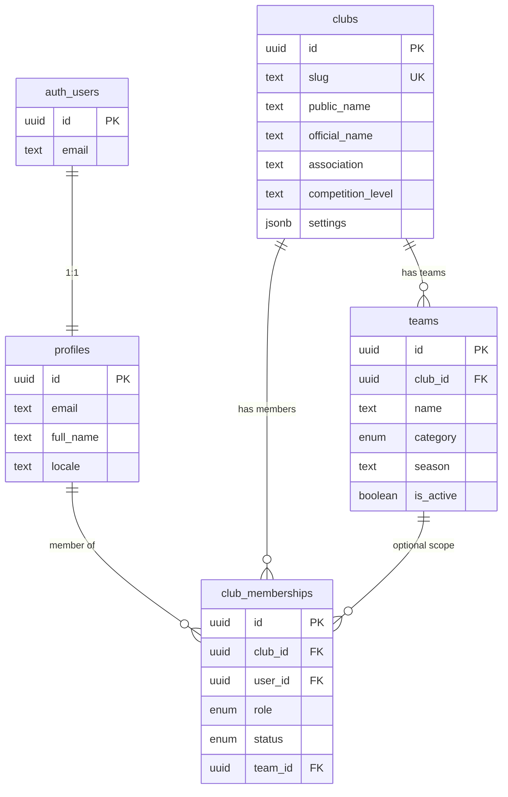
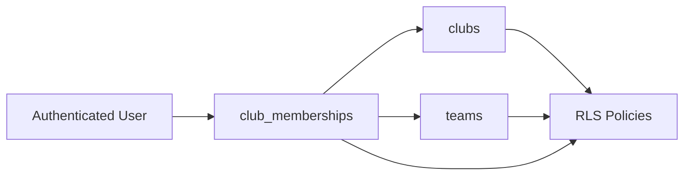

# ERD — Fundament

## Relacje

- `profiles.id` → `auth.users.id` (CASCADE)
- `club_memberships` → unikalność `(club_id, user_id, role)`
- `teams` → unikalność `(club_id, name, category)`

## Diagram przepływu danych multi-tenant

