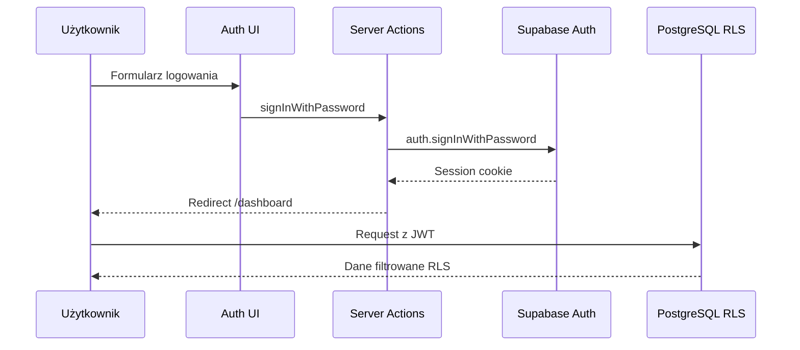

# ETAP 1 — Logowanie i podstawy klubu

Dokumentacja techniczna modułu autoryzacji, RBAC i panelu klubu.

## Zakres

| # | Funkcja | Status |
|---|---------|--------|
| 1 | Logowanie | ✅ |
| 2 | Rejestracja | ✅ |
| 3 | Reset hasła | ✅ |
| 4 | Integracja Supabase Auth | ✅ |
| 5 | Panel użytkownika | ✅ |
| 6 | Profil klubu | ✅ |
| 7 | Zarządzanie drużynami | ✅ |
| 8 | System ról i uprawnień | ✅ |
| 9 | Dashboard | ✅ |
| 10 | Menu nawigacyjne | ✅ |

## Architektura Auth



### Pliki

| Plik | Opis |
|------|------|
| `src/features/auth/actions.ts` | Server Actions: login, register, reset, profile |
| `src/lib/supabase/client.ts` | Klient browser |
| `src/lib/supabase/server.ts` | Klient server + getUser |
| `src/middleware.ts` | Ochrona tras + refresh sesji |
| `src/app/auth/callback/route.ts` | OAuth / email callback |

### Trasy

| Trasa | Dostęp |
|-------|--------|
| `/login` | Publiczna |
| `/register` | Publiczna |
| `/forgot-password` | Publiczna |
| `/reset-password` | Publiczna (z tokenem email) |
| `/dashboard` | Zalogowany + członek klubu |
| `/profile`, `/club`, `/teams`, `/members` | Zalogowany + członek klubu |

## Role klubowe (ETAP 1)

| Kod | Nazwa PL |
|-----|----------|
| `owner` | Właściciel |
| `president` | Prezes |
| `sports_director` | Dyrektor Sportowy |
| `coach` | Trener |
| `player` | Zawodnik |
| `parent` | Rodzic |
| `sponsor` | Sponsor |

Macierz uprawnień: `src/config/permissions.ts`  
Weryfikacja w kodzie: `src/lib/rbac/permissions.ts`  
Weryfikacja w bazie: RLS + `user_has_club_role()`

## Baza danych

### Migracje

1. `20260531120000_foundation.sql` — schemat + RLS
2. `20260531130000_seed_first_club.sql` — klub i drużyna Seniorzy

### Tabele

- `profiles` — profil użytkownika (trigger z auth.users)
- `clubs` — tenant
- `teams` — drużyny
- `club_memberships` — role użytkowników w klubie

### Aplikowanie migracji

```bash
# Dodaj SUPABASE_DB_PASSWORD do .env.local (Dashboard → Database)
npm run setup:stage1
```

Skrypt wykonuje: migracje SQL → seed użytkowników → (opcjonalnie) konfigurację redirect URLs.

## Dane testowe

### Klub

| Pole | Wartość |
|------|---------|
| Nazwa publiczna | Piorun Wawrzeńczyce |
| Nazwa oficjalna | GLKS Mietków |
| Związek | DZPN |
| Poziom | B Klasa |

### Drużyna

- **Seniorzy** (kategoria `seniors`, sezon 2025/2026)

### Użytkownicy testowi

Hasło dla wszystkich: **`Piorun2026!`**

| Email | Rola |
|-------|------|
| wlasciciel@piorun.test | Właściciel |
| prezes@piorun.test | Prezes |
| dyrektor@piorun.test | Dyrektor Sportowy |
| trener@piorun.test | Trener |
| zawodnik@piorun.test | Zawodnik |
| rodzic@piorun.test | Rodzic |
| sponsor@piorun.test | Sponsor |

## Konfiguracja Supabase Auth

W **Authentication → URL Configuration** ustaw:

- Site URL: `http://localhost:3000`
- Redirect URLs:
  - `http://localhost:3000/**`
  - `https://*.vercel.app/**`

Lokalna konfiguracja: `supabase/config.toml`

## Vercel + GitHub

Połączenie repozytorium wymaga instalacji integracji GitHub w Vercel:

1. [vercel.com/dashboard](https://vercel.com) → projekt **pilka**
2. **Settings → Git → Connect Git Repository**
3. Wybierz `dawidthai125/pilka`

CLI (`vercel git connect`) wymaga uprawnień integracji GitHub w koncie Vercel.

## Uruchomienie lokalne

```bash
cp .env.example .env.local
# uzupełnij klucze Supabase + SUPABASE_DB_PASSWORD
npm run setup:stage1
npm run dev
```

Zaloguj się np. jako `wlasciciel@piorun.test` / `Piorun2026!`

## Test plan

- [ ] Logowanie każdą rolą testową
- [ ] Rejestracja nowego użytkownika
- [ ] Reset hasła (email)
- [ ] Edycja profilu użytkownika
- [ ] Edycja profilu klubu (role leadership)
- [ ] Dodanie drużyny (trener / leadership)
- [ ] Widok macierzy RBAC i listy członków
- [ ] Wylogowanie
- [ ] RLS blokuje dane bez członkostwa

## Następny etap (Faza 2)

- Zaproszenia użytkowników
- Przypisywanie ról przez UI
- Zarządzanie członkostwem
