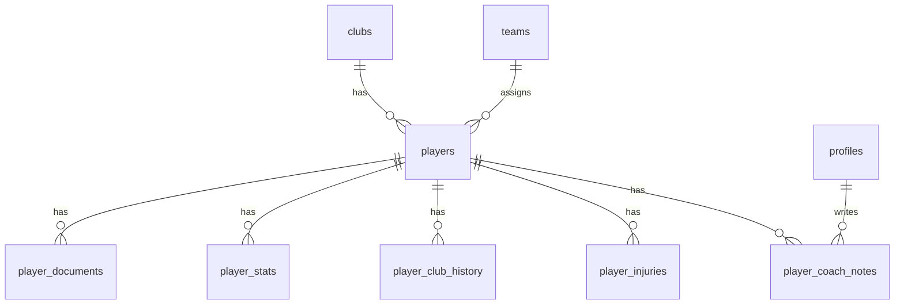

# ETAP 2 — Moduł zawodników

Dokumentacja techniczna modułu zarządzania zawodnikami klubu piłkarskiego.

## Zakres

| # | Funkcja | Status |
|---|---------|--------|
| 1 | CRUD zawodników | ✅ |
| 2 | Profil szczegółowy (6 zakładek) | ✅ |
| 3 | Dokumenty + Supabase Storage | ✅ |
| 4 | Powiadomienia ważności dokumentów | ✅ |
| 5 | Historia klubowa | ✅ |
| 6 | Historia kontuzji | ✅ |
| 7 | Notatki trenerskie (sztab) | ✅ |
| 8 | Statystyki sezonowe | ✅ |
| 9 | Seed 25 zawodników seniorów | ✅ |
| 10 | RLS + uprawnienia RBAC | ✅ |

## Architektura

```
src/features/players/
├── actions.ts              # Server Actions
└── components/
    ├── players-list.tsx
    ├── player-form.tsx
    ├── player-detail-view.tsx
    ├── player-status-badge.tsx
    └── document-alerts-panel.tsx

src/lib/players/
├── constants.ts            # Etykiety, ścieżki storage
├── documents.ts            # Status ważności, alerty
└── mappers.ts              # Mapowanie DB → domena

src/app/(dashboard)/players/
├── page.tsx                # Lista
├── new/page.tsx            # Nowy zawodnik
└── [id]/page.tsx           # Profil + edycja
```

## Tabele bazy danych

### `players`

Główna encja zawodnika — dane osobowe, piłkarskie, status, przynależność do drużyny.

| Kolumna | Typ | Opis |
|---------|-----|------|
| `club_id` | UUID FK | Tenant |
| `team_id` | UUID FK | Drużyna |
| `first_name`, `last_name` | TEXT | Imię i nazwisko |
| `photo_url` | TEXT | Ścieżka w bucket `club-assets` |
| `date_of_birth` | DATE | Data urodzenia |
| `phone`, `email` | TEXT | Kontakt |
| `address`, `city`, `postal_code` | TEXT | Adres |
| `jersey_number` | INT | Numer (unikalny w drużynie) |
| `primary_position`, `secondary_position` | ENUM | Pozycje |
| `dominant_foot` | ENUM | Lewa / prawa / obie |
| `height_cm`, `weight_kg` | INT / NUMERIC | Wzrost, waga |
| `status` | ENUM | active / injured / suspended / inactive |
| `joined_at`, `left_at` | DATE | Daty członkostwa |

### `player_documents`

Metadane dokumentów; pliki w Supabase Storage.

| Kolumna | Opis |
|---------|------|
| `document_type` | medical_exam, parent_consent, club_declaration, insurance, document_photo, other |
| `storage_path` | `{club_id}/players/{player_id}/documents/{doc_id}/{filename}` |
| `expires_at` | Data ważności (opcjonalna) |

Status ważności obliczany w aplikacji (`valid` / `expiring_soon` / `expired`).

### `player_stats`

Statystyki sezonowe (mecze, gole, asysty, kartki, minuty).

### `player_club_history`

Historia: transfery, poprzednie kluby, zmiany pozycji i numeru.  
Trigger `players_log_history` automatycznie zapisuje zmiany pozycji, numeru i drużyny.

### `player_injuries`

Rejestr kontuzji z datą rozpoczęcia, powrotu i statusem aktywności.

### `player_coach_notes`

Notatki sztabu szkoleniowego — typ: observation, progress, health, training_goal.

## Relacje



## Uprawnienia RBAC

Nowe uprawnienia w `src/types/rbac.ts`:

| Uprawnienie | Opis |
|-------------|------|
| `player:read` | Podgląd listy i profili |
| `player:manage` | CRUD, dokumenty, kontuzje, historia |
| `player:notes` | Notatki trenerskie |

| Rola | Uprawnienia zawodników |
|------|------------------------|
| owner, president, sports_director | read + manage + notes |
| coach | read + manage + notes |
| player, parent | read |
| sponsor | brak dostępu |

## Polityki RLS

Funkcje pomocnicze (migracja `20260531160000_players_module.sql`):

- `actor_can_read_players(club_id)` — leadership, coach, player, parent
- `actor_can_manage_players(club_id)` — leadership + coach
- `actor_is_coaching_staff(club_id)` — notatki trenerskie

Storage (`club-assets`):

- SELECT — członkowie z `player:read`
- INSERT/UPDATE/DELETE — sztab szkoleniowy (`actor_can_manage_players`)

## Powiadomienia dokumentów

Progi alertów (`src/lib/players/documents.ts`):

| Poziom | Warunek |
|--------|---------|
| `days_30` | Wygaśnięcie ≤ 30 dni |
| `days_14` | Wygaśnięcie ≤ 14 dni |
| `days_7` | Wygaśnięcie ≤ 7 dni |
| `expired` | Po terminie |

Wyświetlane na dashboardzie w `DocumentAlertsPanel`.

## Migracje

1. `20260531160000_players_module.sql` — tabele, enumy, RLS, triggery
2. `20260531161000_players_storage.sql` — bucket `club-assets`
3. `20260531162000_seed_players.sql` — 25 zawodników seniorów

### Aplikowanie

```bash
npm run setup:stage2
```

## Trasy

| Trasa | Dostęp |
|-------|--------|
| `/players` | `player:read` |
| `/players/new` | `player:manage` |
| `/players/[id]` | `player:read` |
| `/players/[id]?edit=1` | `player:manage` |

## Test plan

- [ ] Lista 25 zawodników (filtr, wyszukiwanie)
- [ ] Dodanie / edycja zawodnika (trener)
- [ ] Upload dokumentu PDF + alert na dashboardzie
- [ ] Podgląd statystyk sezonu
- [ ] Wpis historii i auto-historia przy zmianie numeru
- [ ] Notatka trenerska widoczna tylko dla coach/leadership
- [ ] Rola `sponsor` nie widzi modułu zawodników
- [ ] Responsywność mobile / tablet

## Następny etap

Moduł członkostwa (zaproszenia, przypisywanie ról) — poza scope ETAP 2.
