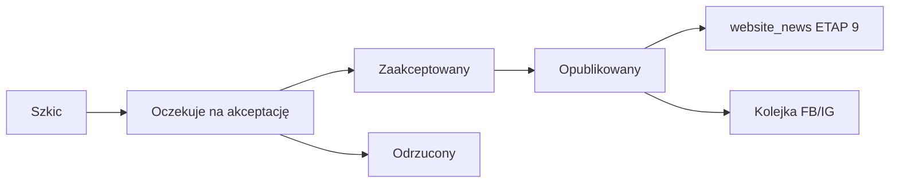

# ETAP 15A — raport: Content Hub

**Data:** 2026-06-01  
**Status:** ✅ zakończony

Powiązane: [moduł Content Hub](./modules/stage-15a-content-hub.md)

---

## 1. Podsumowanie wykonanych prac

| Element | Status |
|---------|--------|
| Moduł Content Hub (`/content`) | ✅ |
| 7 tabel + RLS + storage policies | ✅ |
| Workflow zatwierdzania (5 statusów) | ✅ |
| AI Content Generator (3 kanały) | ✅ |
| AI Match Posts (mecz → website/FB/IG) | ✅ |
| AI Video Posts (ETAP 14 integration) | ✅ |
| Publikacja na stronę klubową (ETAP 9) | ✅ |
| Kolejka social (draft, bez auto-post) | ✅ |
| Kalendarz (dzień/tydzień/miesiąc) | ✅ |
| Biblioteka mediów | ✅ |
| Audyt treści (`content_approvals`, `content_ai_generations`) | ✅ |
| AI Agent tools (3 narzędzia) | ✅ |
| PWA mobile quick action | ✅ |
| Seed Piorun Wawrzeńczyce | ✅ |

---

## 2. Architektura AI Content Generator

1. Użytkownik podaje polecenie (np. „Wygeneruj podsumowanie meczu”).
2. `inferContentTypeFromPrompt` → typ treści.
3. Opcjonalnie kontekst z `matches` / `video_reports`.
4. `generateContentChannels` → OpenAI lub szablon.
5. Zapis: `content_posts` + `content_channel_variants` + log AI.
6. Trener: status `pending_approval`; media manager: `draft`.

Agent AI (`generateContentPost`) wymaga zatwierdzenia (`requiresApproval: true`).  
`proposeContentPublication` **nigdy** nie publikuje — tylko kolejkuje do akceptacji.

---

## 3. Workflow publikacji



Każda akcja logowana w `content_approvals`.

---

## 4. Bezpieczeństwo

- RLS na wszystkich tabelach `content_*`
- `actor_can_publish_content` — trigger DB blokuje publikację przez trenera
- Sponsor: `sponsor_id_for_user()` — tylko własne materiały
- Spójność `club_id` — triggery child tables
- Storage: `club-assets/{clubId}/content/*` z politykami RLS
- Agent nie publikuje bez zatwierdzenia człowieka

---

## 5. Koszty (szacunek miesięczny)

### OpenAI (generacja treści)

| Skala | Założenia | Koszt/mies. |
|-------|-----------|-------------|
| 1 klub | 30 materiałów × ~2k tokenów | ~$1–3 |
| 10 klubów | jak wyżej × 10 | ~$10–30 |
| 100 klubów | jak wyżej × 100 | ~$100–300 |

Bez klucza API: szablony lokalne (0 USD).

### Storage

| Skala | Założenia | Koszt/mies. |
|-------|-----------|-------------|
| 1 klub | 200 MB mediów content | w planie Supabase |
| 10 klubów | ~2 GB | Pro tier |
| 100 klubów | ~20 GB | skalowanie Pro/Team |

### Publikacje social

ETAP 15A: **0 USD** — brak auto-publikacji (tylko draft/kolejka).  
Koszty API Meta/IG w przyszłych etapach.

---

## 6. Weryfikacja

```bash
npm run setup:stage15a
npm run typecheck
npm run build
```

---

## 7. Pliki kluczowe

- `supabase/migrations/20260617120000_stage15a_content_hub.sql`
- `src/features/content/actions.ts`
- `src/lib/content/generator.ts`, `create-from-ai.ts`, `publish.ts`
- `src/app/(dashboard)/content/**`
- `src/lib/ai/agent/tools/registry.ts` (narzędzia Content)

**Nie przechodzono do ETAP 15B** — zgodnie z zakresem.
